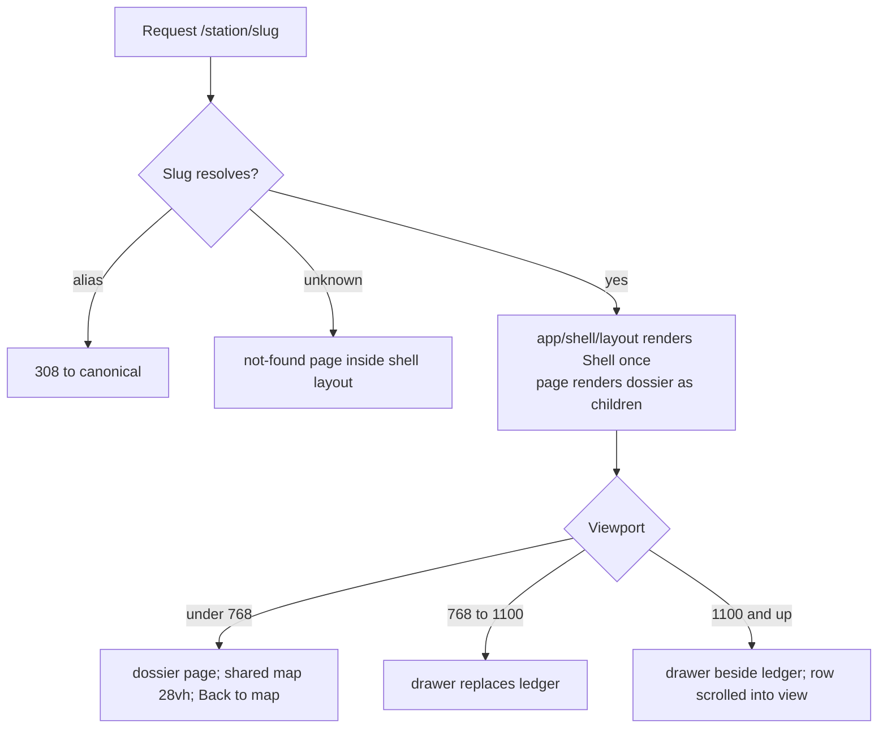
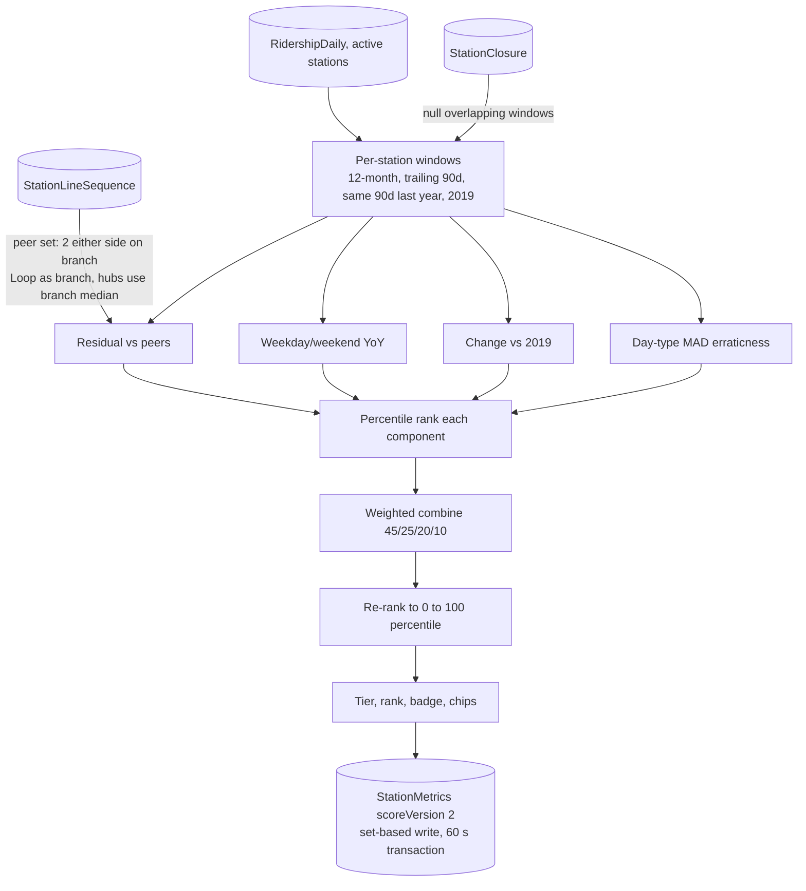
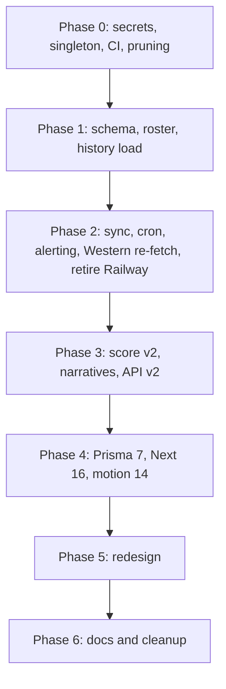

# Ghost Stops Revival - Plan

## Goal Capsule

- **Objective:** A Chicagoan who opens Ghost Stops sees current CTA ridership (within CTA's own publishing lag), a ranking that distinguishes a genuinely fading station from a small steady one, a plain-language reason for every station's position, and a shareable page per station, on any screen size, and the data keeps itself current without anyone running a script, with Nate told when it stops.
- **Means:** Seven sequenced phases (KTD lines cited per unit): rotate and purge leaked credentials, migrate the schema and reload history into Neon, replace the Go ETL with a TypeScript sync on Vercel Cron, ship ghost score v2 with regenerated narratives, upgrade Prisma and Next, rebuild the UI on the "Wayfinding" direction, then clean up and rewrite docs.
- **Authority hierarchy:** This plan's Product Contract governs behavior; the Planning Contract governs mechanism; the audit reports under `docs/audit-2026-10-02/` are evidence, not instruction; the design direction in `docs/audit-2026-10-02/design.md` section 4 (Direction A) and section 5 is the visual authority where this plan is silent.
- **Stop conditions:** Stop and ask before any action that deletes a cloud resource (Railway service, Neon branch, Neon role), before the production migration and load in U8, before a git history rewrite (not planned), and if the Phase 1 dry run projects the loaded database above 800 MB or the upstream sample in U7 disagrees with the snapshot.
- **Execution profile:** Phases ship as separate PRs in order. The Phase 1 PR merges only after the production migration and load are complete (U8). Nothing in Phase 5 begins before Phase 3 is deployed to production.
- **Who finishes and ships:** The implementing agent lands each unit; Nate approves the four cloud-side actions (credential rotation, production migration and load, Railway retirement, Neon branch deletion) and merges each phase PR.

---

## Product Contract

### Summary

Bring the Ghost Stops repo from eight idle months to a maintained, current, and redesigned state. Rotate the two committed secrets; load correct 2001 to 2026 ridership into the Neon production database with fixed station identities, slugs, closures, and line sequences; schedule a daily TypeScript sync on Vercel Cron with failure notification and retire the Railway Go service; replace the ghost score with a percentile-ranked four-component model and regenerate narratives that branch on growth versus decline; upgrade Prisma to 7 and Next to 16; rebuild the UI as a map-first "Wayfinding" shell with a station ledger, a detail drawer that is also a `/station/[slug]` page, and a "why this score" card; then prune dependencies, dead code, and stale docs.

### Problem Frame

Ghost Stops launched on Reddit in February 2026 to a positive reception (205 and 59 upvotes), then sat untouched. The October 2026 audit (`docs/audit-2026-10-02/README.md`) found: production data ends 30 Nov 2025 while CTA has published through 31 Jul 2026; the Go ETL only speaks SQLite and every Railway deployment since 2 Feb 2026 failed, so the daily sync never ran and nobody was told; a live Neon connection string and a Socrata app token are committed at HEAD; the detail API returns 500 for about half of concurrent requests because each route creates and disconnects its own Prisma client; the local snapshot has 32,388 duplicate rows and two Western stations with swapped ids whose entire history since 2001 is therefore misattributed; State/Lake was never ingested and has been closed since January 2026; the ghost score is 98% correlated with raw ridership and its trend term is pure seasonality; the January redesign shipped as a skin with three line palettes and five score color scales; and Reddit users reported a mobile tap bug, growth stations with decline copy, and no visible definition of the score. Nate recently refreshed their portfolio and wants this project brought to the same standard.

### Key Decisions

- **Design stands on its own, not matching Nate's portfolio.** (session-settled: user-directed — chosen over matching the portfolio's visual language: Ghost Stops should read as Chicago, not as a portfolio piece.) Governs R20.
- **Performance and Lighthouse work is out of scope.** (session-settled: user-directed — chosen over including it when the audit scope was picked: the audit found correctness and design problems that dominate.) Governs scope boundaries.
- **Data and scoring land before the redesign.** (session-settled: user-approved — chosen over redesign-first: the new UI must never ship on stale numbers.) Governs sequencing in the Planning Contract.
- **Direction A "Wayfinding", borrowing the dossier page from Direction B.** (session-settled: user-approved — chosen over B "The Dossier" and C "Ledger": keeps the network map and the mobile model that already works.) Governs R20 to R30.
- **Healthy stations drop the "ghost" framing and get a growth or stability story.** (session-settled: user-approved — chosen over one frame with softer wording: Reddit users saw decline copy on growing stations.) Governs R17, R19.
- **Production keeps the full 2001 to 2025 history.** (session-settled: user-approved — chosen over a trailing window: the v2 long-run component and the 2001 facts need it.) Governs R6. Conflict call-out: research found the Neon project is on the Free plan with a 1 GB storage cap and the current row shape would exceed it at 1.3M rows; the decision stands, carried by KTD2 (lean schema first) and the U7 measurement gate.
- **Rotate the secrets; do not rewrite git history.** (session-settled: user-approved — chosen over a force-pushed purge of 26 commits: rotation makes the leaked values worthless and a rewrite invalidates every clone.) Governs R1, R2.
- **A TypeScript sync on Vercel Cron replaces the Go ETL; the Railway service is retired.** (session-settled: user-approved — chosen over porting the Go ETL to Postgres and keeping Railway: one language, one deploy target, no second host.) Governs R10 to R13.
- **Prisma 7 and Next 16 land before the redesign; Tailwind stays on 3.** (session-settled: user-approved — chosen over upgrading after the redesign: new components are written once against the final APIs.) Governs R31 to R33.
- **Growth or stability stories for healthy stations come from the same numbers as the score card.** Chosen so the two never disagree. Governs R19.

### Requirements

**Security**

- R1. The Neon role password and the Socrata app token committed in the repo are rotated, and the old values no longer authenticate.
- R2. No credential value appears in any tracked file, in `.claude/settings.local.json`, or in the untracked `.env.production.example`, and CI fails if one is committed again.
- R3. Local and preview environments get their configuration from an `.env.example` that is actually tracked.

**Data correctness**

- R4. Every station has a correct CTA station id, including Western (Blue, O'Hare branch), Western (Orange), Washington (Blue) and Jefferson Park Transit Center, the id is unique per city, and the two Western stations' full history is re-fetched from upstream so each carries its own series.
- R5. State/Lake exists as a station with status closed since 5 Jan 2026, and closed stations are excluded from ranking.
- R6. Production holds deduplicated daily ridership from 2001 through the latest upstream date, keyed by station and calendar date, with the weekday/Saturday/Sunday day type.
- R7. Stored values match upstream for every month, including CTA's restated 2025 figures.
- R8. Every station has a stable, unique, human-readable slug, and a renamed station's old slug redirects.
- R9. Line order, branches, and the Loop are stored per station so neighbor lookup and peer sets never match by name, including Damen (Green), Halsted (Green), the Ashland/63rd branch, and the Forest Park stations that share names with O'Hare-end stations.

**Freshness and operations**

- R10. Ridership refreshes automatically at least daily, re-fetching a trailing window anchored on the latest published date so upstream revisions are absorbed.
- R11. A refresh is idempotent and safe under duplicate or overlapping invocations.
- R12. Every refresh leaves a durable record (window, rows fetched, rows inserted, rows revised, unmatched station ids, drift months, status, error) readable without Vercel logs, and the record exists from the moment the run starts.
- R13. A health endpoint reports stale data, a failing health check notifies Nate without anyone polling, and the UI states the data-through date as a calendar date and explains CTA's publishing lag separately from refresh failure, with the UI sentence and the health check keyed to the same signal: last successful refresh older than 10 days.

**Scoring and explanation**

- R14. The ghost score is a 0 to 100 percentile over active stations built from four components: residual versus same-branch neighbors (45%), weekday/weekend-separated year-over-year change (25%), change versus 2019 (20%), and day-type-separated erraticness (10%), with no constant context term.
- R15. Component percentiles, their raw inputs, the peer stations used, the tier, the rank, and a score version are persisted per station, written for every station on every run, in the same transaction as the base metrics.
- R16. A component whose window overlaps a closure is null, and the station shows why (for example "reopened Jul 2025, year-over-year available from Jul 2026").
- R17. Tiers are quantile based: ghost (90 and above), fading (75 to 89), quiet (50 to 74), healthy (below 50), and one function owns the tier-to-ink mapping.
- R18. Each station shows a "why this score" card with one row per component stating the plain-language sentence and the real numbers, the peers used, a "small but steady" or "small but growing" badge when the residual is high but both change components are low, and data-quality chips for new, reopened, closed, or stale stations.
- R19. Every station has a narrative generated after scoring whose verbs match the sign of the change, with growth and stable archetypes for healthy stations, no em dashes in rendered text, and a narrative is shown only when its data-through date matches the metrics it describes.

**Product UI**

- R20. Desktop at 1100px and wider shows a map, a 360px ledger of all stations, and a 440px detail drawer; between 768px and 1100px the drawer replaces the ledger while open; below 768px the map is full-bleed with a bottom sheet and the detail is a page.
- R21. `/station/[slug]` renders the full shell with that station selected on desktop widths and the dossier page on mobile widths, on both hard load and in-app navigation, and browser back and forward move between stations.
- R22. Closing the drawer returns to the map; for a direct arrival with no in-app history it navigates to the root rather than leaving the site.
- R23. Official CTA line colors are the only hues on screen and are used only for lines; ghostliness is shown as ink presence (solid, 72%, 44%) and mark shape (solid, hollow, hollow dashed), never as a hue.
- R24. Closed and no-data stations appear in a trailing ledger section under a divider, as a distinct map mark, and as along-the-line rows that show their status; every one of those entry points opens the station's closure dossier.
- R25. The ledger's riders-per-day number is the same 12-month average the residual component uses; the sparkline states its date range.
- R26. The header shows the tier word and rank among ranked stations; the 0 to 100 value appears only inside the card.
- R27. Search filters live, shows a "no stations match" row with a clear action, and Enter opens the first result; line filters are multi-toggle with all-off treated as all-on and a non-color off state; sort toggles direction on the active key; excluded stations sort last.
- R28. Every station row and along-the-line entry is a real button or link with visible focus; focus moves to the drawer header on open and returns to the originating row on close; Escape closes; a live region announces result counts.
- R29. All motion is enter, exit, count-once, draw-once, or fly-to, gated by the user's reduced-motion preference, with no infinite loops.
- R30. Each station page has its own title and description for link previews, dark is the default theme when none is stored, and the theme is applied before first paint.

**Platform**

- R31. The app runs on Prisma 7 with a driver adapter, a pooled connection at runtime, a direct connection for the CLI, explicit pool timeouts, and one client instance per process with no per-request disconnect.
- R32. The app runs on Next 16 with ESLint run directly, and the shell lives in a persistent route-group layout so no parallel route slots are needed.
- R33. Animation uses the `motion` package only; `@react-spring/web` and `@use-gesture/react` are removed.
- R34. Unit tests run non-interactively with the `@/` alias resolved, database-behavior tests run against a real Postgres in CI, and CI runs type check, lint, tests, and a secret scan on every push.

**Hygiene and docs**

- R35. Unused dependencies, the unreachable top-level `components/` directory, the debug API routes, the mock arrivals route, the two tracked Go binaries, and the tracked log files are removed.
- R36. `.claude/CLAUDE.md`, `README.md`, and `DEPLOYMENT.md` describe the system as built; stale docs move to `docs/archive/`; the three contradictions between audit documents (tier count, the "Nov 29" mock date, Phase 1 scope) are resolved in those documents.
- R37. The 157-entry display-name to Socrata-2001-name crosswalk in `scripts/fetch-all-2001.ts` is preserved as data before that file is scrubbed.

### Success Criteria

- On any day the sync has run in the past week, the list API's data-through date equals the upstream dataset's max date (checked with one SoQL `max(date)` query); the calendar gap behind it is CTA's publishing lag, not the sync's.
- A 30-request concurrent sweep of the detail route on a preview deployment returns zero 500s.
- The v2 scorer run over the cleaned snapshot (data through 2025-11-30) reproduces the audit's expectations from `docs/audit-2026-10-02/ghost-score.md` section 5.2 (Halsted Green, King Drive, Kostner and Indiana in the top tier; Evanston Purple stations out of it; LaSalle/Van Buren and Library out of the top two tiers; Wilson fading), and on production data the top and bottom 15 are reviewed by hand with each placement explained by its component rows.
- Western (Blue, O'Hare branch) shows a higher 2019 average than Western (Orange), matching upstream.
- Logan Square's narrative reads as growth.
- A Reddit reader can paste `/station/halsted-green` and see the map, the ledger, and the drawer on a laptop, or the dossier page on a phone.
- Both themes pass WCAG AA contrast on every text style at 13px and above, and no text under 11px exists.
- A failing daily sync produces an email to Nate within a day of the health check turning red.

### Scope Boundaries

- Performance and Lighthouse optimization (session-settled exclusion).
- Ghost trains (missed scheduled runs), bus and Pace connectivity, service-frequency and crime correlation, and any predictive model.
- New cities. The `City` model stays; only Chicago is populated.
- Rewriting narrative facts content or adding census facts beyond what exists in production.
- Tailwind 4.
- Git history rewrite.

#### Deferred to Follow-Up Work

- Open Graph images per station (text metadata ships in U17).
- Event markers for openings and closures on the 90-day chart.
- Precomputing stitched track segments at build time (the browser pipeline stays in this cycle).
- A `walkshedPopulation` and `walkshedJobs` based residual baseline.
- Playwright end-to-end tests. This cycle verifies the drawer and routes on preview deployments by hand and with unit tests.
- Enabling `cacheComponents` in Next 16.
- Tightening `Station.slug` to NOT NULL after U6 has populated it (a one-line follow-up migration).
- A DML-only runtime database role separate from the owner role (least privilege for the public routes and cron).

### Acceptance Examples

- AE1. **Covers R16, R18.** Given Lawrence (reopened 20 Jul 2025) and data through 2026-07-31, when its card renders, then the 12-month residual row and the versus-2019 row show values, the year-over-year row is null with the chip "reopened Jul 2025, year-over-year available from Jul 2026", and no "small but growing" badge appears.
- AE2. **Covers R5, R24.** Given State/Lake with status closed, when a user walks the Brown Line from Washington/Wabash, then State/Lake appears as a row labeled "closed Jan 2026" that opens its closure dossier, the ledger lists it in the trailing "Closed" section, and the map shows the closed mark without a label.
- AE3. **Covers R8.** Given five stations named Western, when slugs are generated, then they are `western-blue-ohare`, `western-blue-forest-park`, `western-brown`, `western-orange`, `western-pink`, and `95th/Dan Ryan` becomes `95th-dan-ryan`, and `O'Hare` becomes `ohare`.
- AE4. **Covers R21, R22.** Given a user who opens `/station/halsted-green` from a Reddit link on a 1280px screen, when the page loads, then the map, ledger, and drawer render with Halsted selected and the Halsted row scrolled into view, and when they press Escape, then the URL becomes `/` and the map remains.
- AE5. **Covers R10, R11.** Given the daily cron fires twice within a minute, when the second invocation starts while the first holds the lease, then it records a skipped run and exits without writing ridership rows.
- AE6. **Covers R13.** Given a data-through date of 2026-07-31 displayed in Chicago, when the header renders, then it reads "Data through 2026-07-31" (not July 30), and the sources disclosure says CTA publishes about two months after the fact.
- AE7. **Covers R7.** Given CTA restates March 2025 for 95th/Dan Ryan, when the weekly reconciliation compares monthly counts and sums, then March 2025 is listed as a drift month in the run record and re-fetched as a month-bounded request on the next run.
- AE8. **Covers R4.** Given the loaded production data, when the 2025-11-03 entries for both Western stations are read, then Western (Blue, O'Hare branch) is 3,476 and Western (Orange) is 2,617, matching upstream.
- AE9. **Covers R22.** Given a user on `/station/a` who navigates to `/station/b` through an along-the-line row, when they close the drawer, then the URL is `/` with the map visible, and browser back then returns to `/station/b`.

### Sources

- `docs/audit-2026-10-02/README.md`, `data-pipeline.md`, `code-quality.md`, `design.md`, `ghost-score.md`, `reddit-feedback.md`: the audit this plan executes.
- Research dossiers consulted during planning: repository patterns, Prisma 7 and Next 16 upgrade guides, Vercel Cron limits, Socrata SODA 2.1 status, Neon Free plan constraints, an end-user flow analysis, deepening reviews for data integrity, deployment readiness, and architecture, and a six-lens document review. Findings that shaped a decision are cited on the KTD they shaped.
- Prisma 7 upgrade guide, Prisma Neon guide, Neon Prisma guide, Next.js 16 upgrade guide and route-group and layout references, Vercel Cron docs, Socrata SODA 2.1 docs, Vercel Fluid compute docs, gitleaks configuration reference.

---

## Planning Contract

### Key Technical Decisions

- KTD1. **Rotate the Neon credential by creating a new role, not by resetting the existing one, unless the leaked role is the owner role.** A new role granted `neondb_owner` membership lets Vercel cut over with zero downtime; both pooled and unpooled strings are set in Production and Preview before the redeploy. If the leaked role is itself `neondb_owner` it cannot be dropped; its password is reset instead once the new role serves traffic. The archived `vercel-dev` Neon branch carries a copy of the leaked role and is deleted. The Socrata token is regenerated in the Chicago Data Portal developer settings and the old one deleted. Research: in-place reset breaks production until a redeploy.
- KTD2. **One migration carries every Phase 1 schema change and the station identity fixes, applied before any data load, with the manual snapshot taken first.** `RidershipDaily` is dropped and recreated lean: composite primary key on station and date, a `DATE` column, a one-character day type, one secondary index on date. `Station` gets `slug` (nullable in this migration, unique per city, populated by U6), `displayName`, `status` (ACTIVE, CLOSED, TEMP_CLOSED), `openedAt`, `closedAt`, and a unique on city plus CTA station id; the four CTA id corrections run as data SQL inside the migration before that unique index is created: Western (Blue, O'Hare branch) to 40670 and Western (Orange) to 40310 in one statement with a conditional expression so the intermediate state never collides, Washington (Blue) to 40370, Jefferson Park Transit Center to 41280. New tables: `StationClosure`, `StationLineSequence`, `SyncRun`. `StationMetrics` gets `scoreVersion`, `tier`, `rank`, `rankedCount`, four component percentiles, raw inputs, `peerStationIds`, `dataThrough`. `StationNarrative` gets `dataThrough`. Research: measured 798 bytes per row today would put 1.3M rows at about 1.04 GB against a 1 GB Free-plan cap; the lean shape lands near 250 to 350 MB. A NOT NULL slug cannot be added to 143 existing rows, and two sequential id updates would collide on the new unique index.
- KTD3. **Load history with `psql \copy` as TRUNCATE plus COPY in one transaction on the direct host, after a branch dry run that also samples the snapshot against upstream, exporting the full deduplicated history through 2025-11-30 except the two Western stations.** The two Western stations' history is misattributed back to 2001 in the snapshot (the Go matcher attributed by the swapped ids), so their rows are excluded from the export and re-fetched from Socrata for 2001 to present by the local runner in U10. A one-year subset loads on a Neon branch to measure size and rehearse a snapshot restore; thirty station-days from 2019 and 2001 are compared against Socrata and the load stops if any differ (the audit saw 2 to 26 percent differences across 2025 and could not say whether earlier years are affected). The production load runs once, in a quiet window, then `ANALYZE`. Exporting the full history keeps the live site's charts populated between Phase 1 and Phase 2; the Phase 2 backfill overwrites the restated 2025 values. Staging-and-swap is rejected because it doubles storage on the Free plan.
- KTD4. **The sync lives in `src/lib/sync/` and is callable from the cron route and from a local runner.** The Socrata client sits behind an interface with a SODA 2.1 implementation (SODA 1 is deprecated; SODA 3 is the stated future). The window is `max(upstream max date, stored max date) - 60 days`, never wall clock, and never moves earlier than that. Upserts use one raw tagged-template statement per chunk with `unnest` arrays and `ON CONFLICT DO UPDATE ... WHERE (entries, dayType) IS DISTINCT FROM (EXCLUDED.entries, EXCLUDED.dayType)`, which absorbs revisions and reports changed rows; inserted and updated counts are split so the run record is honest; no raw statement is ever built by string interpolation. Stations match strictly on CTA station id; unmatched ids land in the run record. A weekly pass compares monthly counts and sums against a SoQL `date_trunc_ym` query and records drift months; each daily run then re-fetches at most three drift months as month-bounded requests, oldest first, after the trailing window, carrying the remainder in the run record. The token travels only in the `X-App-Token` header, and request URLs and headers are never logged. The runner accepts `--since` and `--station-id` for targeted re-fetches. Research: `createMany skipDuplicates` compiles to `DO NOTHING` and cannot absorb revisions; a live probe showed the 60-day window is 8,784 rows in one request; an unbounded drift re-fetch could queue 1.3M rows into a 300-second function.
- KTD5. **The cron is designed to Vercel Hobby limits, uses a `SyncRun` lease column, and failure reaches Nate by email.** (session-settled: user-approved — chosen over porting the Go ETL to Postgres on Railway: one codebase, no second host.) Once per day with up to 59 minutes of jitter, 300-second cap under Fluid compute, no retries, best-effort delivery with possible duplicates, one hour of log retention. Therefore: `maxDuration` 300 and `force-dynamic` on the route; a `SyncRun` row inserted with status running before any fetch and holding the constant lease value in a nullable unique `lease` column (many nulls are allowed, so only one running row can hold it; a partial unique index would be unrepresentable in Prisma 6 and fail the drift gate); a running row older than one hour is expired by nulling its lease and marking it failed; statuses ok, partial, failed, skipped; two schedules on one path branched on the schedule header (daily window, weekly reconciliation); `CRON_SECRET` bearer check with constant-time compare; after commit the route revalidates the stations cache tag; a `/api/health` route returning 503 when the last successful run is older than 10 days or a running row is older than an hour, exposing status and dates only (never the stored error text), with warning fields for unmatched station ids and a drift backlog over twelve months; and a daily GitHub Actions workflow that requests `/api/health` and fails on non-200 so GitHub emails Nate. Wide backfills never run inside the cron; the local runner does them. Fluid compute must be confirmed on in the Vercel project before go-live, since without it the Hobby cap is 60 seconds. If the project is on Pro, nothing changes except headroom.
- KTD6. **Prisma client is a process-wide singleton with no per-request disconnect, fixed on Prisma 6 first.** The 500s are a module-level client torn down by one request's `$disconnect` while another request is mid-query under Fluid compute, not connection exhaustion (901 max connections, 10 open). The fix ships in Phase 0 so production stabilizes immediately. At the Prisma 7 step (U15), `@prisma/adapter-neon` is adopted with the pooled host at runtime and the direct host in `prisma.config.ts` for the CLI; pool `connectionTimeoutMillis` is set explicitly because the adapter default of zero hangs on a cold compute; `pgbouncer=true` is dropped (Neon's pooler runs PgBouncer 1.22+). `prisma` is pinned to 7 because the npm `latest` tag points at an 8.0 release candidate.
- KTD7. **Slugs are stored, not derived at request time.** Rule: lowercase the clean name, drop apostrophes, turn slashes and whitespace into hyphens, and append a line qualifier only when the clean name collides (23 collision groups covering 59 stations). A small alias map issues 308 redirects for renamed slugs; it starts empty and exists so R8 holds the first time a station is renamed. Resolution order is slug, alias, uuid, 404; the uuid branch is removed in U23. Research: the flow analysis found every current component strips the parenthetical, so a name-derived slug would collide and would change under Phase 1 renames.
- KTD8. **`StationLineSequence` models real forks as branches and the Loop as its own branch; Blue is one continuous branch.** Blue runs O'Hare to Forest Park with no divergence, so it is one sequence (the O'Hare and Forest Park names only distinguish ends; name collisions are solved by slugs). Green has Ashland/63rd and Cottage Grove branches forking at Garfield. Purple Express is not a separate sequence. The residual component's peer set is the two open stations either side on the same branch; Loop stations use the other open Loop stations; multi-line hubs (Belmont, Fullerton, Howard, Roosevelt, Clark/Lake) use their primary line's branch median and the card says so. Terminal is derived as first or last on a branch; transfer is more than one line. This replaces the hardcoded `stationSequences.ts` arrays and the `name contains` lookup.
- KTD9. **Closures null any component whose window overlaps them, and status excludes from the percentile population.** `StationClosure` is the source of truth; `Station.status` and `closedAt` are denormalized from it by the seed and recomputed by every sync run so the three never disagree. A closure row per closed range (Lawrence, Argyle, Berwyn, Bryn Mawr 2021 to Jul 2025; State/Lake from Jan 2026, open-ended). `dataStatus` is `zero` when the 30-day average is below 1 and `missing` when no rows in 60 days; both are excluded and shown neutrally.
- KTD10. **Score v2 follows `docs/audit-2026-10-02/ghost-score.md` section 5.2 exactly, with four tiers, one ink mapping, and one set-based write per run covering every station.** Components are percentile ranks over active stations, combined by weight, then re-ranked so the final value is itself a percentile. All reads and all scoring and narrative computation happen outside the transaction; the transaction contains only set-based writes (one `unnest`-driven statement per table for `StationMetrics` and `StationNarrative`), is opened with an explicit timeout of 60 seconds and a 10-second max wait, and writes every station with rank null for excluded stations, so readers never see a half-refreshed ranking and stations that leave the ranked population lose their stale rank. Per-row writes would exceed Prisma's 5-second default and fail every day. The `ghostScore` column keeps receiving the v2 value so the v1 UI keeps working through Phase 4. `getTier(score)` in `src/lib/utils.ts` returns tier, ink level, and mark: ghost is 44% ink and a hollow dashed mark; fading is 72% ink and hollow; quiet is 100% ink and hollow; healthy is 100% ink and solid. The header shows the tier word and "Nth of N ranked"; card copy states that tiers are relative to other stations. Metrics are a table, not a materialized view.
- KTD11. **Narratives are regenerated by a job that runs after scoring in the same run, carry their own data-through date, and the "why" card is the always-present layer.** Templates branch on the sign of each change; two archetypes are added (growth, stable) and selected from the year-over-year and long-run components so the paragraph quotes the same numbers as the card. The detail route withholds a narrative whose data-through date differs from the metrics, showing the card alone, so a narrative job failure can never display stale prose beside fresh numbers. Research: no script in the repo regenerates the 143 production narratives (the seed covers 25); the Logan Square bug is hardcoded decline copy in `src/lib/narratives/archetypes.ts` plus stale pre-rendered text, so a formatter fix cannot repair it.
- KTD12. **The shell lives in a route-group layout; station pages render into it as children; close always returns to the map.** `app/(shell)/layout.tsx` renders the client shell (map, ledger, filters, sort, search, view state) and persists across sibling navigations; `app/(shell)/page.tsx` renders nothing; `app/(shell)/station/[slug]/page.tsx` renders the dossier with `generateMetadata` and a `not-found` boundary. On desktop widths the children area is the 440px drawer; below 768px it is the dossier page with the shared map instance repositioned by CSS and a visible "Back to map" control in its header. Close is always `router.push('/')`, so it lands on the map after any number of neighbor navigations; browser back provides station-to-station history on its own. Neighbor navigation pushes history. An intercepting parallel route was rejected: after a hard load of one station page, a soft navigation to another station leaves the children slot on the stale page and mounts a second drawer in the slot; the layout approach has one selection owner, needs no default files or catch-all, and gives back and forward for free. The shell carries explicit loading and failure states: the ledger shows a skeleton that becomes an error row with a retry action after a failed or slow fetch; the drawer shows an inline failure message with retry; a degraded-health banner appears when the list payload's last successful fetch is older than 10 days.
- KTD13. **Breakpoints are CSS container and media queries, not JavaScript state, and there is one Mapbox instance per viewport.** Below 768px: mobile layout. 768 to 1100px: the drawer replaces the ledger while open. 1100px and above: both. `flyTo` padding is clamped to half the canvas width. The mobile dossier's 28vh map is the shell's map repositioned with a resize call, never a second WebGL context. Mapbox feature state is reapplied after a style swap because the style change drops it. Research: `useIsMobile` starts false on first render, so a server-rendered station page would flash desktop on phones.
- KTD14. **One `Station` type in `src/types/`, one list route with no query parameters, and one freshness source.** `stations-raw` and `stations` return disjoint fields today and nine components each declare their own interface expecting the union. The single route returns slug, display name, lines, status, tier, rank, ranked count, 12-month and 30-day averages, sparkline relative to the station's data-through date, data status, plus top-level data-through and last successful fetch. Sort and filter live in the shell, so the route takes no parameters; its reads are wrapped in `unstable_cache` with the stations tag so the cron's `revalidateTag` actually purges it (a plain read under `revalidate` would not be). Both list and detail read data-through and last successful fetch from the latest successful `SyncRun`, so they cannot disagree; `DataSource.lastSuccessfulFetch` is no longer written.
- KTD15. **Theme is `data-theme` only, applied by an inline script before paint, dark when nothing is stored.** Tailwind `darkMode` switches to the selector form; the `prefers-color-scheme` block in `src/styles/mobile.css` is deleted.
- KTD16. **Motion is the `motion` package only, under `MotionConfig reducedMotion="user"`.** The gauge count-up moves from react-spring to `animate`; the mobile detail's drag-to-close goes away because the detail is a page; vaul keeps the list sheet and never toggles open in response to navigation (Reddit's first-tap close bug lives in that toggle). mapbox-gl `flyTo` is never passed `essential: true` so it honors reduced motion.
- KTD17. **Dates are calendar strings end to end.** `serviceDate` is `DATE` in Postgres, serialized as `YYYY-MM-DD`, formatted with `timeZone: 'UTC'` in the UI. This removes the off-by-one that shows "Nov 29" for a Nov 30 date in Chicago.
- KTD18. **The ledger number is the 12-month average.** The 30-day figure appears inside the card as a secondary number. A 30-day average in a seasonal trough contradicts the score beside it.
- KTD19. **Tests run on Vitest with a config file, the `@/` alias, and two tiers: node-environment unit tests with Prisma mocked via `vitest-mock-extended`, and a `*.db.test.ts` tier against a real Postgres service container in CI after `prisma migrate deploy`.** The database tier is where the behaviors that make R7 and R11 true live (upsert distinctness, lease insert and expiry, migration constraints); mocks cannot prove them. `npm test` becomes `vitest run`; `test:watch` keeps watch mode. CI is GitHub Actions: type check, lint, both test tiers, and the secret scan. Research: there is no Vitest config, no alias for tests, no CI, and `go-etl` has zero tests.
- KTD20. **Secrets in CI and locally; schema changes only by `migrate deploy` from an operator; the secret scan is configured for the shapes that leaked and for retained history.** `.gitignore` gets `!.env.example`. CI runs gitleaks over full git history with a committed `.gitleaks.toml` that extends the default rules with two custom rules, one matching Neon connection strings (a Postgres URI whose password starts with `npg_`) and one matching a Socrata app token keyed on `CHICAGO_DATA_APP_TOKEN`, `$$app_token`, or `X-App-Token`, because the default generic rule does not match a bare `postgresql://` literal; a committed `.gitleaksignore` lists the fingerprints of the historical commits that carry the two rotated values, which is acceptable because they are dead after U1 and the no-rewrite decision keeps them in history. `CRON_SECRET`, `DATABASE_URL` (pooled), `DATABASE_URL_UNPOOLED`, `CHICAGO_DATA_APP_TOKEN`, and `NEXT_PUBLIC_MAPBOX_TOKEN` are the only runtime variables and exist in both Production and Preview. `prisma migrate deploy` never runs in the Vercel build; the operator runs it against the direct URL as an explicit step. The `db:push` script is removed because against production it would offer a destructive reset.
- KTD21. **Module boundaries keep server code out of client bundles by import direction and a lint rule, not a runtime guard.** Import direction is `types` to `cta` to `utils` to `scoring` to `narratives/generate` to `sync/run`; `sync/run` orchestrates scoring and narratives so neither imports the other. An ESLint `no-restricted-imports` rule applied to `src/components/**` forbids importing `src/lib/sync/*`, `src/lib/scoring/*`, `src/lib/narratives/generate.ts`, and `src/lib/prisma.ts`, and `src/lib/narratives/index.ts` never re-exports `generate.ts`. The `server-only` package was rejected because its default entry throws outside Next's bundler, which would crash the local runner, the seed, and every Vitest import of the sync and scoring modules. No file under `src/lib/narratives/`, `src/lib/cta/`, `src/lib/utils.ts`, or `src/types/` imports `src/lib/prisma.ts`.

### High-Level Technical Design

**System data flow after Phase 3.**

```mermaid
flowchart TB
  S[Socrata SODA 2.1<br/>5neh-572f, 8pix-ypme] -->|trailing 60-day window<br/>plus at most 3 drift months| SY[src/lib/sync<br/>window, upsert, match, lease]
  CR[Vercel Cron<br/>daily + weekly schedules] --> API1[/api/cron/sync-ridership]
  API1 --> SY
  LR[Local runner<br/>wide or per-station backfill] --> SY
  SY --> SR[(SyncRun<br/>running first, then final)]
  SY --> RD[(RidershipDaily<br/>composite PK, DATE)]
  SY --> SC[src/lib/scoring<br/>v2 components, tiers, rank]
  SC --> NR[src/lib/narratives/generate<br/>all stations, dataThrough]
  SC --> TX[(one set-based transaction<br/>StationMetrics + StationNarrative)]
  NR --> TX
  API1 -->|revalidateTag after commit| LIST[/api/chicago/stations]
  TX --> LIST
  TX --> DET[/api/chicago/stations/slug]
  SR --> LIST
  SR --> DET
  SR --> H[/api/health]
  GH[GitHub Actions daily check] -->|non-200 emails Nate| H
  LIST --> SH[Shell layout: map + ledger]
  DET --> DR[Station page as drawer or dossier]
```

**Routing contract (KTD12, KTD13).**

| URL | Navigation | Below 768px | 768 to 1100px | 1100px and above | Close |
|---|---|---|---|---|---|
| `/` | any | map + sheet | map + ledger | map + ledger | n/a |
| `/station/[slug]` | hard load | dossier page with 28vh shared map and "Back to map" | shell, drawer open, ledger hidden | shell, drawer + ledger, row scrolled into view | push `/` |
| `/station/[slug]` | soft from `/` | dossier page | shell, drawer open, ledger hidden | shell, drawer + ledger | push `/` |
| `/station/[slug]` to another slug | soft | page content swaps, layout persists | drawer content swaps | drawer content swaps | push `/`; browser back returns to the prior station |
| unknown slug | any | not-found page with search | same | same | n/a |
| aliased old slug | any | 308 to new slug | same | same | n/a |



**Score v2 pipeline (KTD8, KTD9, KTD10).**



**Phase dependencies.**



The audit README numbered phases 0 to 5 with upgrades last. This plan inserts the upgrades as Phase 4 before the redesign per the settled decision, so the audit's Phase 4 is this plan's Phase 5 and the audit's Phase 5 splits into Phase 0 (hygiene) and Phase 6 (docs).

### System-Wide Impact

**Interfaces and consumers during the transition.**

| Interface | Changed by | Consumers until replaced | Compatibility rule |
|---|---|---|---|
| `GET /api/chicago/stations-raw` | untouched until U23 | `MapContainer` (the only list the UI reads) and `StationList` (renders the date) | byte-stable until U20 switches the fetch |
| `GET /api/chicago/stations` (new single list) | U14 | none until U20 | contract-tested in U14; no component depends on it before U20 |
| `GET /api/chicago/stations/{slug or uuid}` | U14 | `StationDetailPanel`, `MobileLayout` fetch by uuid; `NeighborPills` passes neighbor ids; the panel rejects a response lacking `station` and `metrics` | response is a strict superset of today's shape until U21: `station`, `metrics` with `ghostScore`, `percentile`, `explanation`, `comparisons.neighbors.prev/next` with both id and slug, `ridershipSeries`, `facts`, `narrative`, `sources`; new fields are additive |
| `ghostScore` semantics | U12 | `getGhostScoreColor`, gauge thresholds, map paint in both layouts | nothing breaks; the v1 color scale is knowingly miscalibrated from Phase 3 until U18, stated in the Phase 3 PR |
| `StationMetrics` columns | U5, U9, U12 | list, detail, health, narratives | base and v2 columns written in one transaction (KTD10) |
| Prisma schema in the Phase 1 PR | U5 | every route, through the generated client | the PR merges only after the production migration (U8); the old client tolerates the new schema, the new client does not tolerate the old one |
| `src/lib/narratives/index.ts` | U13 | `FactCard` (client) and the detail route | `generate.ts` is never re-exported (KTD21) |
| `src/lib/cta/stationSequences.ts` | deleted in U14 | detail route only | deleted in the same PR that moves the route to the sequence table |
| Shell and routes | U17 | `page.tsx`, `MapContainer`'s mobile branch, `MobileLayout` owning selection and detail fetch | U17 moves selection to the route for both layouts so there is one owner from the first Phase 5 PR |

**Failure propagation.**

| Failure | Database state | What the user sees | Protection |
|---|---|---|---|
| Socrata down | run failed, no writes | date ages; after 10 days the "last refresh" sentence, health 503, and an email to Nate | one trigger for all three (R13, KTD5) |
| Function killed at 300 s mid-upsert | committed chunks stay (idempotent); run row stuck at running | nothing until health treats a running row older than an hour as failed and the daily check emails | KTD5 |
| Lease held | skipped run | nothing | AE5 |
| Unmatched station ids | rows dropped; station drifts to missing | trailing "No recent data" section | health warning on unmatched ids (KTD5) |
| Drift backlog exceeds one run | months carried forward three per day | nothing until the backlog exceeds twelve months, then a health warning | KTD4, KTD5 |
| Scoring throws | base metrics not written either | yesterday's everything, consistently | one transaction (KTD10) |
| Narrative job throws | metrics new, narrative old | card only; stale narrative withheld | narrative data-through check (KTD11) |
| List or detail fetch fails in the browser | n/a | error row or inline message with retry, not an infinite skeleton | KTD12 |

**Caching and state rules.**

- The list route takes no query parameters; its reads are wrapped in `unstable_cache` with the stations tag and hourly revalidation; the cron route revalidates the tag after commit, so the hourly TTL is a fallback.
- Both routes read freshness from the latest successful `SyncRun`.
- Shell state lives in the route-group layout, which persists across sibling navigations; pages remount. The selected station is always visible in the ledger: the row scrolls into view on selection, and a filter or search that would hide it is bypassed for the selected row.
- Feature state is reapplied after Mapbox `style.load`.

### Risks & Dependencies

| Risk | Likelihood | Impact | Mitigation | Owner |
|---|---|---|---|---|
| Neon Free plan 1 GB cap exceeded by the history load | medium | load fails or project is suspended | lean schema first (KTD2); one-year dry run and extrapolation (U7); stop condition at 800 MB | U7 |
| Snapshot history is a different vintage than upstream for years before 2025 | medium | versus-2019 component and R7 wrong for 285 months with no check | thirty station-day sample against Socrata in U7 with a stop condition; Decision pending on loading all history from upstream instead | U7 |
| Production migration drops `RidershipDaily` and the only rollback after six hours is an unrehearsed snapshot restore | low | data loss | snapshot before DDL; restore rehearsed on the dry-run branch; facts and narratives exported locally; Nate confirms at that moment | U8 |
| Phase 1 PR deployed before the production migration | medium | every list and detail request 500s until the migration lands | PR merges only after U8 completes (Goal Capsule, U8, Operational Notes) | U8 |
| Leaked role is `neondb_owner` and cannot be dropped | medium | rotation incomplete | password reset path in KTD1 | U1 |
| Preview deployments break when the old role dies | medium | broken previews | strings set in Preview too (KTD1, KTD20) | U1 |
| Default gitleaks rules miss the leaked Neon URI shape, or a full-history scan can never pass | high | secret gate is theater | custom rules plus history baseline (KTD20) proven against the real files before deletion (U1) | U1, U2 |
| Western history re-fetch misses a renamed Socrata station name | low | one station wrong | verification against upstream for 2019 and 2025-11-03 (AE8) | U10 |
| Cron best-effort delivery misses a day | high | one-day staleness | window re-covers; health keyed to 10 days | U10 |
| Cron stops and nobody notices (the audit's root cause) | medium | months of stale data | daily GitHub Actions health check emails Nate (KTD5, U10) | U10 |
| Fluid compute is off on the Vercel project | unknown | 60-second cap kills every run | confirm in Vercel settings before go-live (Operational Notes U10) | U10 |
| `prisma@latest` installs 8.0 RC | high if unpinned | build breaks | pin to 7 (KTD6) | U15 |
| Socrata moves to SODA 3 | low this year | sync fails | client behind an interface (KTD4); health alerts | U9 |
| Railway deletion is irreversible with no snapshot | low | lose nothing of value, but no return path | gate on seven consecutive calendar days each with an ok cron-triggered run | U11 |
| Phase 5 lands with two selection owners | medium | mobile tap bug persists | U17 moves selection to the route for both layouts | U17 |
| Vercel plan is Hobby (assumed) | n/a | 300 s cap and once-daily cron | design to Hobby; Pro only loosens | U10 |

---

## Implementation Units

### Unit Index

| U-ID | Title | Key files | Depends on |
|---|---|---|---|
| U1 | Rotate credentials and purge secrets | `scripts/fetch-all-2001.ts`, `sync_chicago_data.sh`, `scripts/*sync*`, `docs/debugging-summary.md`, `.gitignore`, `.gitleaks.toml`, `.gitleaksignore`, `.env.example` | none |
| U2 | Test and CI scaffolding | `vitest.config.ts`, `package.json`, `.github/workflows/ci.yml`, `eslint.config.mjs` | none |
| U3 | Prisma singleton on Prisma 6 | `src/lib/prisma.ts`, `src/app/api/**/route.ts` | none |
| U4 | Dependency and dead-code pruning | `package.json`, `components/`, `src/app/api/test`, `src/app/api/stations`, `src/app/api/chicago/stations/[id]/arrivals`, `postcss.config.js`, `prisma/schema.*.prisma` | U2 |
| U5 | Schema migration v2 with identity fixes | `prisma/schema.prisma`, `prisma/migrations/*` | U3 |
| U6 | Roster, slugs, sequences, closures | `src/lib/cta/slug.ts`, `src/lib/cta/sequences.ts`, `src/lib/cta/closures.ts`, `scripts/seed-reference-data.ts` | U5 |
| U7 | History export, upstream sample, dry run | `scripts/export-history.ts`, `docs/runbooks/history-load.md` | U5 |
| U8 | Production migration, history load, Phase 1 merge | `docs/runbooks/history-load.md` | U6, U7 |
| U9 | Sync library | `src/lib/sync/*` | U6, U8 |
| U10 | Cron, health, alerting, local runner, backfill, Western re-fetch | `src/app/api/cron/sync-ridership/route.ts`, `src/app/api/health/route.ts`, `vercel.json`, `.github/workflows/health.yml`, `scripts/run-sync.ts` | U9 |
| U11 | Retire Go ETL and Railway | `go-etl/`, `Dockerfile`, `deploy-vercel.sh`, `DEPLOYMENT.md` | U10 |
| U12 | Score v2 | `src/lib/scoring/*`, `src/lib/utils.ts` | U9 |
| U13 | Narrative regeneration | `src/lib/narratives/*`, `src/lib/sync/run.ts` | U12 |
| U14 | API v2 and shared types | `src/types/station.ts`, `src/app/api/chicago/stations/route.ts`, `src/app/api/chicago/stations/[slug]/route.ts` | U12, U13 |
| U15 | Prisma 7 | `prisma.config.ts`, `prisma/schema.prisma`, `src/lib/prisma.ts`, `package.json` | U14 |
| U16 | Next 16, ESLint CLI, motion 14, react-map-gl 8.1 | `package.json`, `eslint.config.mjs`, `next.config.ts`, `tailwind.config.ts` | U15 |
| U17 | Route-group shell and station page | `src/app/(shell)/**`, `src/components/shell/*`, `src/components/mobile/*` | U16 |
| U18 | Tokens, typography, tier function | `src/app/globals.css`, `src/app/layout.tsx`, `tailwind.config.ts`, `src/lib/utils.ts` | U16 |
| U19 | Map layers | `src/components/map/*` | U17, U18 |
| U20 | Ledger | `src/components/ledger/*` | U17, U18 |
| U21 | Dossier and why card | `src/components/dossier/*` | U17, U18 |
| U22 | Motion, accessibility, retirements | `src/components/**`, `package.json` | U19, U20, U21 |
| U23 | Docs, archive, remaining cleanup | `.claude/CLAUDE.md`, `README.md`, `docs/`, `.gitignore` | U22 |

### Phase 0: Secrets, stability, scaffolding

### U1. Rotate credentials and purge secrets

- **Goal:** The leaked Neon password and Socrata token stop working, no credential remains in the tree, the secret scan is proven against the real leaked shapes, and the 2001 crosswalk survives.
- **Requirements:** R1, R2, R3, R37.
- **Dependencies:** none.
- **Files:** `scripts/fetch-all-2001.ts`, `src/lib/cta/socrata2001Names.ts` (new, data only), `sync_chicago_data.sh` (delete), `scripts/manual_sync_stations.sh` (delete), `scripts/sync_missing_stations.sh` (delete), `scripts/sync_missing_stations.py` (delete), `docs/debugging-summary.md` (delete), `.claude/settings.local.json` (untracked; remove the token entry), `.env.production.example` (untracked; scrub), `.gitignore`, `.gitleaks.toml` (new), `.gitleaksignore` (new), `.env.example` (new, tracked), `go-etl/etl` and `go-etl/go-etl` (untrack), `sync_debug.log` and `sync_output.log` (delete), `src/lib/cta/socrata2001Names.test.ts`.
- **Approach:** Per KTD1, KTD20.
  1. Nate lists Neon roles on the production branch to learn whether the leaked role is `neondb_owner`. Nate creates a new role with `neondb_owner` membership, confirms it can read `Station` over the direct host, sets `DATABASE_URL` (pooled) and `DATABASE_URL_UNPOOLED` for Production and Preview on Vercel, redeploys, and verifies the list route. Then: reset the old role's password immediately; drop the role after 24 hours if it is droppable. Delete the archived `vercel-dev` Neon branch (confirm the branch first). Regenerate the Socrata token, set `CHICAGO_DATA_APP_TOKEN` on Vercel, delete the old token.
  2. Write `.gitleaks.toml` with the two custom rules and run gitleaks over the working tree before any deletion; it must flag `scripts/fetch-all-2001.ts` and the five token-bearing files, proving the rules match the real shapes.
  3. Move the 157-entry name map out of `scripts/fetch-all-2001.ts` into a data module; rewrite that script to read `DATABASE_URL` from the environment.
  4. Delete the five files that carry the token; scrub the untracked example; add `!.env.example` to `.gitignore` and commit an example with names only.
  5. Untrack the two binaries and two logs; add `*.log` and `go-etl/etl` patterns.
  6. Verify with `git log -S` on both values that no other tracked copies exist; write `.gitleaksignore` with the fingerprints of the historical commits that carry the two dead values; run the full-history scan and confirm it passes.
- **Execution note:** Rotation precedes removal. Removal without rotation leaves the values live in history.
- **Test scenarios:**
  - The crosswalk module exports 157 entries and every display name resolves to exactly one Socrata name.
  - gitleaks with the committed config flags the pre-deletion tree and passes the post-deletion tree with the history baseline.
  - The old Neon password fails to authenticate (Nate confirms); the old Socrata token returns 403.
- **Verification:** Production and a preview deployment serve with the new role; `git ls-files` shows `.env.example` tracked and no binaries or logs; the full-history gitleaks scan is clean.

### U2. Test and CI scaffolding

- **Goal:** Tests run non-interactively with the `@/` alias, database behavior is tested against real Postgres in CI, and CI gates every push.
- **Requirements:** R34, R2.
- **Dependencies:** none.
- **Files:** `vitest.config.ts` (new), `package.json`, `.github/workflows/ci.yml` (new), `.nvmrc` (new), `eslint.config.mjs` (restricted-imports rule).
- **Approach:** Per KTD19, KTD20, KTD21. Vitest config with node environment, the alias from `tsconfig.json`, and two projects: unit (mocked Prisma via `vitest-mock-extended`) and `*.db.test.ts` (real client against `DATABASE_URL`); `test` runs once, `test:watch` watches. CI: Node 22, `npm ci`, type check, lint, unit tests, a Postgres service container with `prisma migrate deploy` then the database tests, and gitleaks over full history with the committed config. Add `engines` to `package.json`. Add the `no-restricted-imports` rule for `src/components/**`. The Go tree is not built in CI; it is deleted in U11.
- **Patterns to follow:** The existing test `src/lib/cta/normalizeStationLines.test.ts` (co-located, `describe` nesting).
- **Test scenarios:**
  - The existing 23 normalize tests pass under the new config via `npm test`.
  - A test importing from `@/lib/utils` resolves.
  - A database-tier smoke test connects to the CI Postgres and reads the migrations table.
  - CI fails on a branch containing a fake Neon URI and a fake app token, and passes once that commit is dropped from the branch.
  - Lint fails on a component that imports from `src/lib/sync`.
- **Verification:** A green CI run on the Phase 0 PR.

### U3. Prisma singleton on Prisma 6

- **Goal:** The detail route stops failing under concurrency.
- **Requirements:** R31 (partial: singleton and no disconnect; adapter arrives in U15).
- **Dependencies:** none.
- **Files:** `src/lib/prisma.ts` (new), `src/app/api/chicago/stations-raw/route.ts`, `src/app/api/chicago/stations/route.ts`, `src/app/api/chicago/stations/[id]/route.ts`, `prisma/schema.prisma` (add `directUrl`), `package.json` (remove `db:push`), `src/lib/prisma.test.ts`.
- **Approach:** Per KTD6, KTD20. A `globalThis`-cached client; every route imports it; every `$disconnect()` in handlers is removed; the detail route logs the underlying error in its catch; `pgbouncer=true` is dropped from the pooled URL on Vercel; `directUrl` points at the unpooled variable for migrations.
- **Test scenarios:**
  - Importing the module twice yields the same instance.
  - A test asserts no route handler source contains a disconnect call.
- **Verification:** On a preview deployment, 30 concurrent detail requests return zero 500s (the audit measured 17 of 30 failing before).

### U4. Dependency and dead-code pruning

- **Goal:** `npm audit` is near zero and the tree contains only reachable code.
- **Requirements:** R35.
- **Dependencies:** U2.
- **Files:** `package.json`, `components/` (delete), `src/app/api/test/` (delete), `src/app/api/stations/` (delete), `src/app/api/chicago/stations/[id]/arrivals/` (delete), `src/components/ghost/GhostScoreHero.tsx` (delete), `src/components/mobile/MobileViewListFAB.tsx` (delete), `src/components/map/map.tsx` (delete; import `MapContainer` directly), `postcss.config.js` (delete), `postcss.config.mjs`, `prisma/schema.sqlite.prisma` and `prisma/schema.postgres.prisma` (delete), `prisma/seed.ts` (delete), `deploy-vercel.sh` (delete), `tailwind.config.ts` (content globs), `src/app/layout.tsx` (metadata no longer claims real-time arrivals), `scripts/archive/` (move the 18 unreferenced scripts).
- **Approach:** Remove the dependencies the audit found unused: `claude`, `shadcn-ui`, `vercel`, `sqlite`, `sqlite3`, `apache-arrow`, `ts-node`, `@types/mapbox-gl`, `@types/react-map-gl`, `@radix-ui/react-icons`, `@tanstack/react-query`, `class-variance-authority`, and the 13 Radix packages used only by the unreachable `components/ui/`. Move `autoprefixer`, `shapefile`, `unzipper`, `@turf/turf` to dev dependencies. `npm update` within semver. Delete `console.log` debug lines in `MapContainer`.
- **Test expectation:** none, behavior-preserving removal. Type check and build are the proof.
- **Verification:** `npx tsc --noEmit` clean; `next build` succeeds; `npm audit` shows no critical or high findings.

### Phase 1: Schema, roster, history

### U5. Schema migration v2 with identity fixes

- **Goal:** The production schema can hold 1.3M lean rows, slugs, status, closures, sequences, sync runs, and v2 metrics, with station identities corrected before the new unique index exists.
- **Requirements:** R4, R5, R6, R8, R9, R12, R15, R19.
- **Dependencies:** U3.
- **Files:** `prisma/schema.prisma`, `prisma/migrations/<timestamp>_revival_v2/migration.sql`, `prisma/migrations/*.db.test.ts`, `docs/runbooks/history-load.md` (new; records the migration step).
- **Approach:** Per KTD2. One migration generated from the schema and hand-edited so index and constraint names stay Prisma-conventional and so the data SQL for the four CTA id corrections (per KTD2: Western Blue O'Hare 40670 and Western Orange 40310 in one conditional statement, Washington 40370, Jefferson Park 41280) runs before the unique index on city plus CTA station id is created. `RidershipDaily` is dropped and recreated lean; `slug` is nullable in this migration. `StationMetrics` and `StationNarrative` gain their columns with defaults so existing rows survive. The operator applies it with `prisma migrate deploy` against the direct URL, first on the dry-run branch (U7), then on production in U8. The Phase 1 PR that carries this schema is not merged until U8 completes, because the newly generated client selects columns the production database does not yet have.
- **Technical design (directional):** `RidershipDaily(stationId, serviceDate DATE, entries, dayType CHAR(1))` with primary key `(stationId, serviceDate)` and index `(serviceDate)`. `Station` adds `slug` (nullable), `displayName`, `status`, `openedAt`, `closedAt`; unique `(cityId, slug)` and `(cityId, ctaStationId)`. `StationClosure(stationId, startDate, endDate?, reason)`. `StationLineSequence(stationId, line, branch, seq)` unique `(line, branch, seq)`. `SyncRun(trigger, startedAt, finishedAt?, status, lease String? unique, windowStart, windowEnd, upstreamMaxDate, rowsFetched, rowsInserted, rowsRevised, unmatchedStationIds json, driftMonths json, error, durationMs)`. `StationMetrics` adds `scoreVersion`, `tier`, `rank`, `rankedCount`, `residualPct`, `yoyPct`, `longRunPct`, `erraticPct`, `avg12m`, `avg30d`, `baselineAvg`, `peerStationIds json`, `yoyChangePct`, `vs2019Pct`, `weekdayAvg`, `weekendAvg`, `dataThrough DATE`. `StationNarrative` adds `dataThrough DATE`.
- **Test scenarios (database tier):**
  - `prisma migrate diff` from the applied branch database to the schema reports no drift.
  - Inserting the same station and date twice fails on the primary key.
  - Two stations in the same city cannot share a slug or a CTA station id.
  - Two `SyncRun` rows cannot both hold the lease value; many rows with a null lease can coexist.
  - After the migration on the dry-run branch, the two Western stations carry 40670 and 40310 respectively and `StationFact` and `StationNarrative` row counts are unchanged.
- **Verification:** Migration applies cleanly on the Neon branch; `stations-raw` and the detail route still serve on the branch with the old client (they read no new columns); the Phase 1 client serves on the branch after the migration.

### U6. Roster, slugs, sequences, closures

- **Goal:** Every station has a slug, a display name, a status, closures where applicable, and a branch-aware sequence position, and the roster matches the current CTA system.
- **Requirements:** R4, R5, R8, R9.
- **Dependencies:** U5.
- **Files:** `src/lib/cta/slug.ts` (new), `src/lib/cta/slug.test.ts`, `src/lib/cta/sequences.ts` (new; replaces `stationSequences.ts` data with branch-aware definitions), `src/lib/cta/sequences.test.ts`, `src/lib/cta/closures.ts` (new, data), `src/lib/cta/slugAliases.ts` (new, empty map), `scripts/seed-reference-data.ts` (new; idempotent), `src/lib/cta/stationSequences.ts` (delete after the API moves in U14).
- **Approach:** Per KTD7, KTD8, KTD9. The seed updates stations by their existing uuid and never deletes or recreates a station, so facts and narratives keep their foreign keys.
  1. Insert State/Lake 40260 with lines Brown, Green, Orange, Pink, Purple, status CLOSED, `closedAt` 2026-01-05, and a closure row; remove the `State/Lake` to `Lake (Subway)` alias; resolve the four alias collisions; fix `Station.lines` (remove Green from Quincy, LaSalle/Van Buren, Washington/Wells, Library; add Purple to Wilson); set `displayName` for `Lake (Subway)` and `Jefferson Park Transit Center`.
  2. Generate slugs for all stations with the KTD7 rule; the seed asserts uniqueness before writing.
  3. Define sequences per line: Blue as one continuous branch from O'Hare to Forest Park; Green with the Ashland/63rd and Cottage Grove branches forking at Garfield; the Loop as a ring branch shared by Brown, Orange, Pink, Purple, Green; Red, Brown, Orange, Pink, Purple, Yellow as single branches; seed `StationLineSequence`, including Damen and Halsted on Green.
  4. Closure rows for Lawrence, Argyle, Berwyn, Bryn Mawr (2021-05 to 2025-07-20) and State/Lake; derive `status` and `closedAt` from them.
  5. Run the seed against the Neon branch first, then production inside the U8 window.
- **Patterns to follow:** `normalizeStationLines` for clean names; the existing alias table for lookups.
- **Test scenarios:**
  - Covers AE3. Slugs for the five Western stations, 95th/Dan Ryan, O'Hare, Harold Washington Library-State/Van Buren are as specified and all 144 slugs are unique.
  - The four production spellings that differ from local resolve to the same slugs.
  - Walking every branch end to end through the sequence table visits every station on that line exactly once and the Loop ring closes.
  - Harlem (Blue, Forest Park end) neighbors are Oak Park and Forest Park; Harlem (Blue, O'Hare end) neighbors are Cumberland and Jefferson Park.
  - Division (Blue, in the Dearborn subway) has peers on both sides and is not a terminal.
  - Ashland/63rd neighbors are Halsted (Green) and nothing further south.
  - An alias entry, when one exists, resolves to its canonical slug; the empty map resolves nothing.
  - The seed run twice reports zero changes the second time and the station count stays 144.
- **Verification:** No station has a null slug after the seed; the API's neighbor payload for Harlem (Forest Park end) names Oak Park.

### U7. History export, upstream sample, dry run

- **Goal:** A clean CSV of deduplicated history exists, its vintage is checked against upstream, the loaded size is measured, and the restore path is rehearsed before touching production.
- **Requirements:** R6, R4, R7.
- **Dependencies:** U5.
- **Files:** `scripts/export-history.ts` (new), `scripts/sample-upstream.ts` (new), `docs/runbooks/history-load.md`.
- **Approach:** Per KTD3. Export from a copy of `prisma/dev.db`: keep RFC3339-dated rows only (every non-RFC3339 row has a twin), drop the 90 orphans, exclude the two Western stations entirely (their history is re-fetched in U10), normalize to `YYYY-MM-DD`, derive day type from the calendar (W, A, U; the sync overwrites it with Socrata's value for everything it re-fetches), and assert distinct station-date count equals row count and that every station id exists in production. Export the full history through 2025-11-30 so the live site keeps its charts between Phase 1 and Phase 2. Sample thirty station-days from 2019 and thirty from 2001 and compare against Socrata; any difference stops the plan (Goal Capsule stop condition) pending the Decision on loading from upstream. Also export production `Station`, `StationFact`, and `StationNarrative` to local CSV as an independent backup. Create a Neon branch, apply U5's migration, run the U6 seed, load one calendar year, measure total relation size, extrapolate, rehearse a snapshot restore onto the branch, record all of it in the runbook, delete the branch.
- **Execution note:** The dry run is the only trustworthy size and timing number and the only rehearsal of the rollback; do not skip it.
- **Test scenarios:**
  - The export script on a fixture SQLite with a mixed-format duplicate pair emits one row.
  - An orphan row (station id not in Station) is excluded.
  - Rows for the two Western station uuids are excluded.
  - Day type derivation marks Saturdays A and Sundays U.
  - The sample script reports a mismatch when a fixture value differs from the recorded upstream value.
- **Verification:** The runbook records the measured size per year and the projected total under 800 MB (stop condition otherwise), the sixty-sample comparison result, the restore rehearsal outcome, and the location of the three backup CSVs.

### U8. Production migration, history load, Phase 1 merge

- **Goal:** Production holds the deduplicated history on the lean schema with corrected identities, facts and narratives are untouched, and the Phase 1 code deploys only after the schema exists.
- **Requirements:** R4, R6.
- **Dependencies:** U6, U7.
- **Files:** `docs/runbooks/history-load.md`.
- **Approach:** Per KTD2, KTD3. Operator steps, each confirmed by Nate, in this order: delete any existing manual snapshot (Free allows one), take the manual snapshot and note the time; apply the U5 migration on production over the direct URL; run the U6 seed; `TRUNCATE` plus `\copy` in one transaction on the direct host; `ANALYZE`; verify; then merge the Phase 1 PR and wait for the production deploy. Until the merge, the branch's preview deployment is expected to fail on list and detail and is not used as evidence; the old production code tolerates the new schema (U5 verification) so the migrate-first window is safe. This is the single most dangerous step in the plan; its gates are listed under Operational Notes.
- **Test expectation:** none, operator procedure. Verification queries are the proof.
- **Verification:** Row count equals the export; min and max dates and per-month counts match the export; `StationFact` count is 625 and a checksum over id, key, and value is unchanged; `StationNarrative` count is 143 and max `lastComputed` is unchanged; every metrics, fact, and narrative station id joins to `Station`; `prisma migrate diff` reports no drift; the list and detail routes respond before and after the Phase 1 deploy; total relation size is under 800 MB.

### Phase 2: Sync and schedule

### U9. Sync library

- **Goal:** A tested module fetches a trailing window from Socrata, upserts it, updates base metrics, and records the run from start to finish, bounded to the cron budget.
- **Requirements:** R7, R10, R11, R12.
- **Dependencies:** U6, U8.
- **Files:** `src/lib/sync/socrata.ts` (interface and SODA 2.1 client), `src/lib/sync/window.ts`, `src/lib/sync/upsert.ts`, `src/lib/sync/match.ts`, `src/lib/sync/reconcile.ts`, `src/lib/sync/lease.ts`, `src/lib/sync/run.ts`, `src/lib/sync/baseMetrics.ts`, `src/lib/sync/*.test.ts`, `src/lib/sync/*.db.test.ts`, `src/lib/sync/__fixtures__/` (Socrata JSON samples).
- **Approach:** Per KTD4, KTD5, KTD10, KTD21. The run function: insert a `SyncRun` row as running holding the lease (or record skipped if the unique lease rejects it, after expiring any running row older than an hour); ask Socrata for its max date; compute the window; page with a deterministic order; match rows on CTA station id; upsert in chunks of about 5,000 with the `unnest` statement whose distinctness test covers entries and day type, splitting inserted from revised counts; then re-fetch at most three drift months, oldest first, as month-bounded requests; compute base metrics (12-month, 30-day, 90-day averages, data-through, data status) and, when U12 and U13 are present, scores and narratives, all outside any transaction; write everything in one set-based transaction per KTD10; finalize the run row with ok, partial, or failed and null the lease. The weekly reconciliation compares monthly counts and sums and records drift months in the run record.
- **Execution note:** Build the upsert, window, and lease logic test-first; upsert distinctness and lease behavior are database-tier tests, the rest are unit tests on fixtures; the Socrata client gets one recorded-response test.
- **Patterns to follow:** `safeJsonParse` from `src/lib/utils.ts`; the Go matcher's special cases in `go-etl/internal/chicago/matcher.go` as a reference for historical name quirks, not for fuzzy matching.
- **Test scenarios:**
  - Window anchored on an upstream max of 2026-07-31 yields 2026-06-01 regardless of today's date, and a drift month in 2019 does not move it.
  - Database tier: a row whose entries and day type equal the stored values produces zero revised rows; a differing day type alone produces one.
  - Inserted and revised counts are reported separately for a batch with both.
  - Covers AE7. A fixture where one month's upstream sum differs lists that month as drift, and the next run issues exactly one month-bounded fetch for it.
  - Four drift months yield three fetches in one run and one carried forward.
  - An unknown CTA station id lands in `unmatchedStationIds` and does not abort the run.
  - Database tier, covers AE5. A second run while a row holds the lease records status skipped; a running row older than an hour is expired, its lease nulled, and the new run proceeds.
  - A run that throws after upserting finalizes as partial with the error recorded and the lease released.
  - Base metrics for a station with no rows in 60 days set data status missing.
  - The write path issues a bounded number of statements independent of station count.
- **Verification:** Against the Neon branch, a run from 2026-06-01 inserts about 8,784 rows and a second identical run revises zero rows; both runs have finalized `SyncRun` rows with null leases.

### U10. Cron, health, alerting, local runner, backfill, Western re-fetch

- **Goal:** The sync runs daily on Vercel, a failure emails Nate, production data becomes current, and the two Western stations carry their own history.
- **Requirements:** R4, R10, R11, R12, R13.
- **Dependencies:** U9.
- **Files:** `src/app/api/cron/sync-ridership/route.ts` (new), `src/app/api/health/route.ts` (new), `vercel.json`, `.github/workflows/health.yml` (new), `scripts/run-sync.ts` (new local runner), `src/app/api/cron/sync-ridership/route.test.ts`, `src/app/api/health/route.test.ts`, `.env.example`, `docs/runbooks/history-load.md`.
- **Approach:** Per KTD4, KTD5, KTD20. Route: GET, bearer check, `maxDuration` 300, `force-dynamic`, branch on the schedule header between daily and weekly modes, revalidate the stations tag after commit, return a JSON summary of status and counts only. `vercel.json` adds two cron entries on the same path. Health: 503 when the last successful run is older than 10 days or a running row is older than an hour; 200 with both dates otherwise; warning fields for unmatched ids and a drift backlog over twelve months; never the stored error text. A daily GitHub Actions workflow requests the health route and fails on non-200, so GitHub emails Nate. Nate confirms Fluid compute is enabled on the Vercel project and adds `CRON_SECRET` before the Phase 2 PR deploys. The local runner accepts `--since` and `--station-id` and runs the same library unbounded. After the PR deploys and before the first scheduled fire, Nate runs it with `--since 2024-10-01` to backfill the corrected window, then with `--station-id 40670` and `--station-id 40310` from 2001 to fill the two Western stations.
- **Test scenarios:**
  - A request without the bearer header returns 401; with the wrong value returns 401; with the right value runs.
  - The weekly schedule header selects reconciliation mode.
  - Health returns 503 when the latest successful run is 11 days old and when a running row is 61 minutes old; its body never includes the error column.
  - Health carries a warning when the drift backlog exceeds twelve months.
  - The runner with `--station-id` fetches only that station and its run record names it.
- **Verification:** `dataAsOf` on the list API becomes 2026-07-31; 95th/Dan Ryan 2025-03-03 reads the restated 5,333; AE8 holds for the Western pair and their 2019 averages are ordered as upstream; the first scheduled cron run appears as an ok `SyncRun` row within the scheduled hour plus 59 minutes with duration under 300 seconds; health returns 200; the health workflow has one green run; a deliberately failing health response in a test branch produces a failed workflow run and an email.

### U11. Retire Go ETL and Railway

- **Goal:** One pipeline exists and the docs describe it.
- **Requirements:** R35, R36 (partial).
- **Dependencies:** U10.
- **Files:** `go-etl/` (delete), `Dockerfile` (delete), `DEPLOYMENT.md` (rewrite for Vercel plus Neon only), `.vercelignore`.
- **Approach:** After seven consecutive calendar days each with an ok `SyncRun` row whose trigger is cron, delete the Go tree and Docker files; Nate deletes the Railway service and its volume (confirmed action, irreversible). `DEPLOYMENT.md` documents: Vercel env names for Production and Preview, the direct-URL migration step, the cron, the health route and its GitHub Actions check, and the local runner for wide and per-station backfills.
- **Test expectation:** none, removal and docs.
- **Verification:** CI green; Railway project shows no service; `DEPLOYMENT.md` has no Railway section.

### Phase 3: Score v2 and narratives

### U12. Score v2

- **Goal:** Every active station has a defensible 0 to 100 score with persisted components, tier, and rank, written atomically with base metrics, and validated against the snapshot where the audit's expectations hold.
- **Requirements:** R14, R15, R16, R17.
- **Dependencies:** U9.
- **Files:** `src/lib/scoring/windows.ts`, `src/lib/scoring/peers.ts`, `src/lib/scoring/components.ts`, `src/lib/scoring/percentile.ts`, `src/lib/scoring/score.ts`, `src/lib/scoring/__fixtures__/stations.json` (Halsted Green, Logan Square, State/Lake, Damen Green, Lawrence, LaSalle/Van Buren, Wilson, O'Hare, Western Blue O'Hare), `src/lib/scoring/*.test.ts`, `src/lib/scoring/snapshot.db.test.ts`, `src/lib/utils.ts` (`getTier`), `src/lib/sync/run.ts` (hook).
- **Approach:** Per KTD8, KTD9, KTD10, KTD21. Read each station's windows once via the primary key; derive peers from the sequence table; null components whose windows overlap a closure or predate `openedAt`; percentile-rank each component over stations where it is non-null (null gets the median and a chip); combine; re-rank; hand the results to the run's single set-based transaction with `ghostScore` set to the v2 value and rank null for excluded stations. The badge rule: residual percentile 75 or above with both change percentiles below 50. The fixture file is the shared contract with U21. The acceptance oracle is the cleaned snapshot (data through 2025-11-30) loaded into the CI Postgres: the audit's named expectations were computed on that data and are correct there; on production data the top and bottom 15 are reviewed by hand and each placement must be explained by its component rows.
- **Execution note:** Test-first on the fixture; the snapshot database test is the acceptance test.
- **Test scenarios:**
  - Covers AE1. Lawrence's year-over-year is null with the reopened chip; its 12-month residual and versus-2019 are computed; no badge.
  - State/Lake is excluded from the ranked population, has rank null, and keeps a metrics row.
  - Ranks are contiguous from 1 to the ranked count with no gaps or duplicates.
  - A Loop station's peers are the other open Loop stations.
  - Clark/Lake uses its primary line's branch median and the metrics record says so.
  - Weekday and weekend averages are computed separately and recombined 5:2.
  - Percentile ranking of a tie yields equal ranks.
  - `getTier` maps 95 to ghost with 44% ink and hollow dashed, 80 to fading, 60 to quiet, 30 to healthy.
  - A station with a high residual and low change components gets the "small but steady" badge; with growth it gets "small but growing".
  - When scoring throws, no base metrics are written for that run and the run finalizes as failed.
  - Database tier, snapshot oracle: Halsted (Green), King Drive, Kostner and Indiana are in the top tier; the Evanston Purple stations are not; LaSalle/Van Buren and Library are not in the top two tiers; Wilson is fading.
- **Verification:** The snapshot oracle test passes in CI; after a run on production, the distribution spans the full 0 to 100 range and the hand review of the top and bottom 15 finds every placement explained by its rows.

### U13. Narrative regeneration

- **Goal:** Every station has a narrative whose language matches its numbers, including healthy ones, and a stale narrative is never shown beside fresh metrics.
- **Requirements:** R19.
- **Dependencies:** U12.
- **Files:** `src/lib/narratives/archetypes.ts`, `src/lib/narratives/renderer.ts`, `src/lib/narratives/formatters.ts`, `src/lib/narratives/generate.ts` (new; all-station job), `src/lib/narratives/*.test.ts`, `src/lib/sync/run.ts` (hook), `scripts/seed-narratives-phase1.ts` (delete), `src/app/api/chicago/stations/[id]/route.ts` (remove the O'Hare override and `factLabels`; one label table in `formatters.ts`).
- **Approach:** Per KTD11, KTD21. Every template branches on sign; add `growth` and `stable` archetypes whose selection reads the year-over-year and long-run components; render from those same numbers; remove em dashes and emoji from templates; generate all stations after scoring and hand the rows to the run's set-based transaction with `dataThrough`; keep existing facts and sources; check that every evidence fact key referenced exists for that station. The one hardcoded O'Hare narrative becomes an `airport_gateway` archetype with the same text.
- **Test scenarios:**
  - Logan Square (growth from 3,796 to 3,947) renders "has grown to" and "+4%".
  - A station with a 70% decline renders decline copy.
  - A healthy station with no 2001 fact still gets a `stable` or `growth` narrative from components.
  - Rendered text contains no em dash.
  - A narrative referencing a fact key the station lacks is rejected by the job and logged.
  - The job is idempotent: a second run with unchanged metrics leaves `lastComputed` as the only change.
- **Verification:** All 144 stations have a narrative row with `templateVersion` v2 and `dataThrough` equal to metrics; Logan Square's story reads as growth in the API.

### U14. API v2 and shared types

- **Goal:** One list route and one slug-addressed detail route return everything the new UI needs, with no name matching, while the current UI keeps working.
- **Requirements:** R8, R13, R15, R18, R19, R25, R26.
- **Dependencies:** U12, U13.
- **Files:** `src/types/station.ts` (new shared types), `src/app/api/chicago/stations/route.ts` (the single list route), `src/app/api/chicago/stations/[slug]/route.ts` (rename from `[id]`), `src/app/api/chicago/stations/[slug]/route.test.ts`, `src/app/api/chicago/stations/route.test.ts`, `src/lib/cta/stationSequences.ts` (delete).
- **Approach:** Per KTD7, KTD11, KTD14, KTD17, KTD18. List takes no query parameters, wraps its reads in `unstable_cache` with the stations tag and hourly revalidation, and returns all stations with slug, display name, lines, status, tier, rank, ranked count, 12-month and 30-day averages, sparkline of the last 7 days ending at the station's data-through date with its date range, data status, plus top-level data-through and last successful fetch from the latest successful `SyncRun`. Detail resolves slug, alias (308), uuid, then 404; returns a strict superset of today's shape (see System-Wide Impact) plus the why-card payload (component rows with sentences, numbers, peers, nulls with chip reasons, badge), comparisons via the sequence table with neighbor ids, slugs, and status, series with gaps for missing days, facts, narrative only when its data-through matches the metrics, sources. Errors no longer leak messages. `stations-raw` is left byte-stable.
- **Test scenarios:**
  - A slug resolves; its alias returns 308 to the canonical URL; a uuid resolves; an unknown value returns 404.
  - The detail response contains every key the current `StationDetailPanel` reads, with neighbor entries carrying both id and slug.
  - Neighbor payload for Harlem (Forest Park end) names Oak Park and Forest Park with slugs.
  - State/Lake appears in the Brown Line neighbor walk with status closed and no score.
  - The sparkline for a station whose data ends 2026-07-31 covers 2026-07-25 to 2026-07-31 and the payload states that range.
  - Data-through is the string `2026-07-31`, not a timestamp, and equals the value on the detail route.
  - A narrative whose data-through lags the metrics is omitted from the response.
  - The why-card payload for Lawrence marks the year-over-year row null with the reopened chip.
- **Verification:** Both routes pass contract tests with a mocked client; `stations-raw` still serves the current UI unchanged; the current detail panel renders against the renamed route by uuid.

### Phase 4: Platform upgrades

### U15. Prisma 7

- **Goal:** The app runs on Prisma 7 with the Neon adapter and the concurrency fix intact.
- **Requirements:** R31.
- **Dependencies:** U14.
- **Files:** `package.json` (pin `prisma@7`, `@prisma/client@7`, add `@prisma/adapter-neon`, `@neondatabase/serverless`, `dotenv`), `prisma.config.ts` (new), `prisma/schema.prisma` (generator `prisma-client` with output; datasource without url), `src/lib/prisma.ts`, `.gitignore` (generated client dir), `vercel.json` (build command unchanged), `scripts/*.ts` that construct clients.
- **Approach:** Per KTD6, KTD20. Direct URL in the config for the CLI; pooled URL to the adapter at runtime with explicit pool size and connection timeout; import the client from the generated output path everywhere. `DATABASE_URL_UNPOOLED` must exist in Preview as well because the config evaluates it during the build. Deploy to a preview and repeat the 30-request concurrency sweep; run the seed and the local runner against the Neon branch with the new import path. Re-check the `migrate diff` flags against the pinned 7.x CLI.
- **Test scenarios:**
  - Route tests still pass with the mocked client from the new import path.
  - A generated client exists after `prisma generate` and `next build` succeeds.
  - The database-tier tests pass against the CI Postgres with the adapter.
- **Verification:** Preview concurrency sweep returns zero 500s; `prisma migrate diff` clean; the next scheduled cron run finalizes ok with comparable duration.

### U16. Next 16, ESLint CLI, motion 14, react-map-gl 8.1

- **Goal:** The framework stack is current before any new UI is written.
- **Requirements:** R32, R33 (package rename only; removal of react-spring happens in U22).
- **Dependencies:** U15.
- **Files:** `package.json`, `eslint.config.mjs`, `next.config.ts`, `tailwind.config.ts` (`darkMode` selector form), `src/components/map/MapContainer.tsx` and `src/components/mobile/MobileLayout.tsx` (react-map-gl `/mapbox` imports), `.github/workflows/ci.yml`.
- **Approach:** Run the Next upgrade codemod; replace the lint script with ESLint directly and simplify the flat config, keeping the restricted-imports rule; bump `eslint-config-next` to 16; drop `--turbopack`; set `outputFileTracingRoot` to the repo to silence the workspace-root inference caused by a stray parent lockfile; drop `output: standalone` (Vercel ignores it and the Dockerfile is gone); do not enable `cacheComponents`. Rename `framer-motion` imports to `motion/react` at 14; upgrade `react-map-gl` to 8.1 with `/mapbox` imports; bump `@types/node` to 22.
- **Test scenarios:**
  - Lint runs via ESLint directly and passes.
  - `next build` succeeds and the dev server starts without the Turbopack flag.
  - Existing tests pass.
- **Verification:** Preview deployment renders the current UI identically; CI green.

### Phase 5: Redesign

### U17. Route-group shell and station page

- **Goal:** Stations have URLs, the shell persists across navigation with explicit loading and failure states, selection has one owner on every viewport, and the dossier is a page with its own way back.
- **Requirements:** R20, R21, R22, R30, R32.
- **Dependencies:** U16.
- **Files:** `src/app/layout.tsx` (inline theme script, fonts), `src/app/(shell)/layout.tsx` (new; renders the client shell), `src/app/(shell)/page.tsx` (new; renders nothing), `src/app/(shell)/station/[slug]/page.tsx` (new), `src/app/(shell)/station/[slug]/not-found.tsx`, `src/app/page.tsx` (delete), `src/components/shell/Shell.tsx`, `src/components/shell/Drawer.tsx`, `src/components/shell/useStationDetail.ts`, `src/components/shell/HealthBanner.tsx`, `src/components/mobile/MobileLayout.tsx` (selection and detail fetch removed; reads the route), `src/components/mobile/MobileStationDetail.tsx` (becomes the mobile page variant of the dossier container with a "Back to map" control), `src/components/layout/ResponsiveProvider.tsx` (delete; CSS breakpoints), `src/components/map/MapContainer.tsx` (mobile branch removed; the shell decides by CSS), `src/app/sitemap.ts`, `src/app/robots.ts`, `src/components/shell/*.test.tsx`.
- **Approach:** Per KTD12, KTD13, KTD15. The shell owns stations, filters, sort, search, and view state in the route-group layout and reads selection from the route segment. Breakpoints via CSS. `generateMetadata` on the station page builds "Halsted (Green) · 248 riders/day · Ghost Stops" from the detail payload. Close always pushes `/`. The list fetch has loading, slow, and failure states (skeleton, then an error row with retry); the detail fetch has an inline failure message with retry; a degraded-health banner shows when the list payload's last successful fetch is older than 10 days. The mobile page keeps the top bar with the data-through sentence and adds a "Back to map" control in the dossier header. The theme inline script sets `data-theme` before paint. `MobileLayout` stops owning selection and the detail fetch in this unit so Phase 5 never has two owners.
- **Execution note:** Verify hard load, soft navigation between two stations, back and forward, and close on a preview deployment, not only locally; the Verification Contract carries this as a row.
- **Test scenarios:**
  - Covers AE4. Rendering the station page with a slug marks that station selected in the shell model.
  - Covers AE9. Close after neighbor navigation pushes `/`; the drawer is gone and the map is visible.
  - Close from a direct arrival pushes `/`.
  - Soft navigation from one station page to another leaves exactly one dossier mounted.
  - Unknown slug renders the not-found page inside the shell with the search box.
  - A failed list fetch renders the error row with a retry action, not a skeleton; a failed detail fetch renders the inline message with retry.
  - A list payload with last successful fetch 11 days old renders the health banner.
  - Metadata for a station includes its line and riders per day.
  - The sitemap lists every open and closed station slug.
- **Verification:** On a preview deployment: deep link shows the shell with the drawer; refresh keeps it; neighbor navigation then close lands on the map; browser back then returns to the last station; navigating to `/` via the wordmark closes the drawer; filter state survives opening and closing a station; the mobile page's "Back to map" returns to the map.

### U18. Tokens, typography, tier function

- **Goal:** One color table, one type system, one tier mapping, and no glass or loops in CSS.
- **Requirements:** R17, R23.
- **Dependencies:** U16.
- **Files:** `src/app/globals.css`, `src/styles/glassmorphism.css` (delete), `src/styles/animations.css` (delete), `src/styles/typography.css` (delete), `src/styles/mobile.css` (delete the color-scheme block), `tailwind.config.ts`, `src/app/layout.tsx` (Archivo and JetBrains Mono only), `src/lib/utils.ts` (`ctaLineColors` as the single table, `getTier`), `src/lib/ctaLineColors.ts` (delete), `src/lib/cta/explodeSegments.ts` (import colors from utils), `src/lib/utils.test.ts`.
- **Approach:** Per KTD10, KTD15. Wayfinding tokens from `docs/audit-2026-10-02/design.md` section 4 (surface, surface-2, rule, ink, ink-2, ink-3 for dark and light; official line colors; presence ramp). Radius 4px for controls and 0 for panels. Yellow and Pink chips carry dark text.
- **Test scenarios:**
  - `getTier` boundaries at 90, 75, 50.
  - Every line color equals the official hex in `docs/audit-2026-10-02/design.md`.
  - Contrast check: ink-3 on surface in both themes meets AA at 13px (a unit test over the token values with a contrast function).
- **Verification:** No `glass`, `noise`, or infinite keyframe remains in CSS (grep in CI as a test).

### U19. Map layers

- **Goal:** Stations render as circle and symbol layers with presence marks, one map instance serves every viewport, and the camera respects the drawer.
- **Requirements:** R23, R24, R29.
- **Dependencies:** U17, U18.
- **Files:** `src/components/map/MapView.tsx` (new; replaces the map parts of `MapContainer.tsx`), `src/components/map/layers.ts`, `src/components/map/StationMarker.tsx` (delete), `src/components/map/MapTooltip.tsx` (delete), `src/components/map/LineFilter.tsx` (delete; filter moves to the ledger header), `src/components/map/layers.test.ts`.
- **Approach:** Per KTD13. Dark and light base styles with POI, transit, and road labels hidden; tracks via the existing `explodeAndStitchSegments` pipeline with the single color table; stations as a circle layer where paint derives from tier (ink level, stroke for hollow, dash via a second layer for ghost) and status (closed mark without label); symbol labels from zoom 12.5 with ink halo; selection as inversion with a 2px ring; `flyTo` 900ms with padding clamped to half the canvas; hover state on the circle layer replaces the tooltip; a tap on a closed mark opens its closure dossier like any other mark; filtered-out lines dim on both desktop and mobile; feature state reapplied on `style.load`; the mobile dossier repositions this same map to 28vh and calls resize.
- **Test scenarios:**
  - Layer paint expression maps tier to the specified ink opacities.
  - A closed station produces the closed mark and no label, and clicking it navigates to its slug.
  - Padding clamp returns 440 at 1280px and 384 at 768px.
  - After a style swap, the selected station's feature state is restored.
- **Verification:** Visual check at 375, 900, and 1440px in both themes on a preview deployment; no DOM markers remain; one WebGL context on a phone.

### U20. Ledger

- **Goal:** The station list is a keyboard-accessible ledger with correct sort, filter, search, selection visibility, and closed-station handling, fed by the new list route.
- **Requirements:** R24, R25, R27, R28.
- **Dependencies:** U17, U18.
- **Files:** `src/components/ledger/Ledger.tsx`, `src/components/ledger/LedgerRow.tsx`, `src/components/ledger/LedgerHeader.tsx` (sort, line bars, search), `src/components/ledger/useLedgerModel.ts`, `src/components/charts/Sparkline.tsx` (restyle, fed from the list route), `src/components/station/StationList.tsx` and `StationRow.tsx` (delete), `src/components/map/MapContainer.tsx` (fetch switched to the new list route), `src/components/ledger/*.test.tsx`.
- **Approach:** Per KTD14, KTD18, R27, R28. Rows are buttons; 56px; rank in mono, display name, line bars, 12-month riders per day, sparkline as a labeled image whose accessible name states its date range (not a hover-only title attribute), presence shown by row ink and mark. Excluded stations in a trailing section under a hairline "Closed" or "No recent data" divider regardless of sort; their rows navigate to the closure dossier. The selected row scrolls into view on selection and is shown even when a filter or search would hide it. Search, filter, and sort state live in the shell and survive drawer navigation; not in the URL. Escape in the search field clears the query first; a second Escape closes the drawer. Live region announces counts. Mobile uses the same rows inside the vaul sheet.
- **Test scenarios:**
  - Covers AE2 (ledger part). State/Lake sorts into the trailing section under every sort key.
  - All-off line filter behaves as all-on.
  - Search "xyz" renders the no-match row; Enter with "Halsted" opens the first match.
  - Sort toggles direction on repeat.
  - Rows are focusable and Enter activates them.
  - Selecting a station hidden by the Red-only filter shows its row and scrolls to it.
  - The sparkline's accessible name includes the date range.
- **Verification:** Keyboard-only walkthrough on a preview deployment reaches every row and opens a drawer; sparklines render for every station with data; a deep link scrolls the ledger to the selected row.

### U21. Dossier and why card

- **Goal:** One dossier component renders the station story in the drawer and on the mobile page, with the why card as its core and defined variants for closed, no-data, new, and reopened stations.
- **Requirements:** R13, R16, R18, R19, R24, R25, R26.
- **Dependencies:** U17, U18.
- **Files:** `src/components/dossier/StationDossier.tsx`, `src/components/dossier/SignHeader.tsx`, `src/components/dossier/WhyCard.tsx`, `src/components/dossier/Baselines.tsx` (from `ComparisonBars` logic), `src/components/dossier/AlongTheLine.tsx` (from `NeighborPills` logic), `src/components/dossier/Sources.tsx`, `src/components/station/RidershipChart.tsx` (restyle; draw gaps; visible dated caption), `src/components/narrative/StationStory.tsx` (restyle; drop emoji disc and quality pill), `src/components/station/StationDetailPanel.tsx`, `src/components/ghost/GhostScoreGauge.tsx`, `src/components/ghost/GhostScoreBadge.tsx`, `src/components/ghost/GhostWatermark.tsx` (delete all four), `src/components/dossier/__fixtures__/` (reuse `src/lib/scoring/__fixtures__/stations.json`), `src/components/dossier/*.test.tsx`.
- **Approach:** Section order from `docs/audit-2026-10-02/design.md` Direction A: sign header (display name, line bars, terminal or transfer tag; for closed or no-data stations the header shows the status and date in place of tier and rank); the number (12-month riders per day at 56px mono, tier word and "Nth of N ranked" beside it with a one-line note that tiers are relative to other stations; 30-day inside the card); baselines (system, line, neighbors); why card (four rows, badge, chips, closed and new variants); 90-day chart in ink with the primary line color stroke and a visible dated caption; along the line (two full rows with status; closed rows show their status and open the closure dossier per R24); sources with the CTA lag sentence and, when the last successful refresh is older than 10 days, the last-refresh sentence. Mobile page: "Back to map" control, the shared map at 28vh, then the same order. Focus on open goes to the sign header; on close it returns to the originating ledger row when one is mounted and visible, else to the ledger search field.
- **Test scenarios:**
  - Covers AE1. Lawrence renders the reopened chip on the year-over-year row, values on the other rows, and no badge.
  - Covers AE2 (dossier part). State/Lake renders the status and closure date in the header, the closure sentence, and no component rows.
  - A no-data station renders "No recent data" in place of tier and rank.
  - Covers AE6. Data-through 2026-07-31 renders as that string; a last successful refresh 11 days old adds the last-refresh sentence.
  - A healthy station shows a stable or growth narrative and no "ghost" heading.
  - A response without a narrative renders the card alone with no empty section.
  - Chart series with missing days render gaps, not zeros, and the caption states the date range.
  - Along-the-line rows are links with slugs; a closed neighbor renders with its status and links to its closure dossier.
  - Closing with the originating row hidden moves focus to the search field.
- **Verification:** Fixture stories render for all nine fixture stations in both themes without layout breakage at 375 and 1440px.

### U22. Motion, accessibility, retirements

- **Goal:** Motion is gated, focus is managed, contrast passes, and the retired dependencies and components are gone.
- **Requirements:** R28, R29, R33, R35.
- **Dependencies:** U19, U20, U21.
- **Files:** `src/app/layout.tsx` (`MotionConfig`), `src/components/shell/Drawer.tsx` (focus management, Escape), `src/components/ledger/LedgerHeader.tsx` (`aria-pressed`, non-color off state), `src/components/mobile/MobileBottomSheet.tsx` (never toggles open on navigation), `src/components/layout/TopBar.tsx` (logo animation removed), `src/lib/motion/tokens.ts` (drop react-spring configs), `package.json` (remove `@react-spring/web`, `@use-gesture/react`), `src/components/**/*.test.tsx`.
- **Approach:** Per KTD16. Drawer 240ms, rows 120ms with 15ms stagger, count once over 600ms, chart draws once, fly-to 900ms, all under `MotionConfig reducedMotion="user"`; with reduced motion the sort reorder is instant and numbers render final. Focus rules per U21. Verify the first-tap bug on a real phone.
- **Test scenarios:**
  - With reduced motion, the count renders the final value on first paint.
  - Opening the drawer moves focus to the header; closing returns it to the row when present.
  - Escape closes the drawer; Escape inside a non-empty search field clears it instead.
  - Filter bars expose pressed state.
  - No import of `@react-spring/web` or `@use-gesture/react` remains (grep test).
- **Verification:** axe or equivalent on the preview shows no contrast or name violations; a phone test opens a station on the first tap.

### Phase 6: Docs and cleanup

### U23. Docs, archive, remaining cleanup

- **Goal:** The repo describes itself truthfully and carries no leftovers.
- **Requirements:** R36, R35, R8.
- **Dependencies:** U22.
- **Files:** `.claude/CLAUDE.md` (rewrite: Next 16, Prisma 7, Postgres, sync and scoring modules, token and tier rules, real paths and commands), `README.md`, `DEPLOYMENT.md`, `docs/archive/` (move `UI Overhaul Design Audit.md`, `ui-review-findings.md`, `review-2026-02-01.md`, `chicago-mvp-progress.md`), `docs/audit-2026-10-02/design.md` and `ghost-score.md` and `README.md` (resolve the three contradictions by pointing at this plan's KTD10 and U5), `.gitignore`, `scripts/fix_line_extraction.md` (delete), `src/app/api/chicago/stations-raw/` (delete now that U20 switched), `src/app/api/chicago/stations/[slug]/route.ts` (remove the uuid fallback).
- **Approach:** Rewrite from the code, not from the old docs. The audit folder stays as history.
- **Test expectation:** none for docs. The uuid-fallback removal updates the U14 route test so a uuid now returns 404.
- **Verification:** A fresh clone with `.env.example` filled in runs the dev server and the tests.

---

## Operational Notes

Go/no-go material for the four riskiest deployments. Each line names the signal that proves the step.

**U1 credential rotation.** Rollback is full until the old password is reset, then forward-only. Pre: role listing names the leaked role and whether it is `neondb_owner`; `vercel-dev` is archived with no endpoint; the gitleaks config flags the pre-deletion tree. Steps: new role reads `Station` over the direct host; both strings visible in Production and Preview env listings; redeploy serves the list route; old string fails authentication; branch listing shows production only; old Socrata token returns 403; full-history scan passes with the baseline. 24 hours: runtime error count flat; gitleaks green.

**U8 migration, load, and Phase 1 merge.** The single most dangerous step is `prisma migrate deploy` against production: it drops `RidershipDaily` and its only rollback after six hours is a snapshot restore. Gates, all required: manual snapshot present and the restore rehearsed on the dry-run branch (U7); the sixty-sample upstream comparison passed; facts and narratives exported locally; CSV passes the distinct-count and station-id checks; dry-run projection under 800 MB; the Phase 1 PR is open but not merged; Nate confirms at that moment. Steps: snapshot listed with time noted; two rows in the migrations table and the lean table shape visible; seed reports 144 stations and zero changes on a second run; COPY row count equals the CSV; the U8 verification queries all match; merge the PR; the production deploy serves list and detail. Rollback: instant restore within six hours (keeps the connection string), snapshot restore after; partial fallback is re-running the idempotent load plus the local fact and narrative CSVs; the PR is reverted if the deploy fails. 24 hours: Neon storage gauge stable; detail latency not worse; no key violations in logs.

**U10 backfill, cron go-live, alerting.** Pre: Fluid compute confirmed enabled in the Vercel project's function settings; `CRON_SECRET` set in Production; branch run inserts about 8,784 rows and a repeat revises zero; production max date recorded. Steps in order: deploy; unauthenticated cron GET returns 401; local runner from 2024-10-01 finalizes ok with unmatched ids empty and max date 2026-07-31; Western re-fetch finalizes ok and AE8 holds; health 200; the health workflow runs green once; the first scheduled run finalizes ok under 300 seconds inside its hour plus 59 minutes. Rollback: remove the cron entries or rotate the secret; overwritten rows are recoverable only from the U8 snapshot and upstream is the source of truth. 24 hours: one ok run per day; no pile-up of skipped runs; known cosmetic: the v1 color scale is miscalibrated until U18.

**U15 Prisma 7.** Rollback is full (revert or instant rollback; no database change). Pre: `DATABASE_URL_UNPOOLED` present in Preview; pool timeout set; `pgbouncer=true` absent; seed and runner succeed on the branch with the new import. Steps: CI green with `prisma generate` before `next build` in the preview log; 30 concurrent detail requests return zero 500s; production routes 200. 24 hours: the next cron run finalizes ok with comparable duration.

**U17 shell routes.** Gate before merge: on a preview deployment, hard load and soft navigation of a station URL return 200, two consecutive station navigations leave one dossier mounted, close lands on the map, browser back returns to the prior station, the mobile page's "Back to map" works, and a forced list fetch failure shows the retry row.

---

## Verification Contract

| Check | Command or procedure | Applies to | Pass signal |
|---|---|---|---|
| Type check | `npx tsc --noEmit` | every unit | no errors |
| Lint | `npm run lint` (`next lint` until U16, `eslint .` after), including the restricted-imports rule | every unit | no errors |
| Unit tests | `npm test` (`vitest run`, unit project) | U1 onward | all pass; CI green |
| Database tests | `vitest run` database project against the CI Postgres after `prisma migrate deploy` | U5, U9, U12, U15 | all pass |
| Secret scan | gitleaks over full history with `.gitleaks.toml` and `.gitleaksignore` in CI | every PR | zero findings |
| Build | `npx next build` | U4, U15, U16, U17 onward | succeeds |
| Schema drift | `npx prisma migrate diff --from-url <direct> --to-schema-datamodel prisma/schema.prisma` (flags re-checked at U15) | U5, U8, U15 | no drift |
| Concurrency | 30 parallel GETs of the detail route on a preview deployment | U3, U15 | zero 500s |
| Upstream vintage | sixty station-day sample (2019 and 2001) against Socrata | U7 | all equal |
| Data integrity | U8 verification queries (counts, dates, fact checksum, narrative count, FK joins, size) | U8 | all match the runbook baseline |
| Data freshness | GET the list route and read data-through | U10 | 2026-07-31 or later |
| Western attribution | AE8 values and 2019 ordering | U10 | match upstream |
| Health and alerting | GET `/api/health`; the daily GitHub Actions health workflow | U10, U11 | 200 with dates; workflow green; a forced failure produces an email |
| Scheduler reliability | count of calendar days with an ok cron-triggered `SyncRun` row | U11 | seven consecutive days before Railway deletion |
| Score oracle | snapshot database test in CI; hand review of production top and bottom 15 | U12 | oracle passes; every placement explained by its rows |
| Routing | hard load, soft nav between two stations, close, back, mobile back-to-map, forced fetch failure, at 375, 900, 1440px on a preview deployment | U17 | all rows of the routing contract behave; one dossier mounted |
| Accessibility | axe on the preview, keyboard walkthrough, contrast test in unit tests | U18, U20, U22 | no violations |
| Device | open a station on a real phone | U22 | first tap opens the detail |

No `release:validate` script exists in this repo.

---

## Definition of Done

**Global**

- All 37 requirements are met and traceable to a shipped unit.
- Every Success Criterion holds against production.
- CI is green on `main`; no skipped tests.
- No abandoned-attempt code remains from any unit; dead components and dependencies named in U4 and U22 are gone.
- `.claude/CLAUDE.md` matches the code.
- Nate has confirmed each cloud-side action and the Railway service no longer exists.

**Per phase**

| Phase | Done when |
|---|---|
| 0 | Old credentials fail; the full-history secret scan passes with the committed config; preview concurrency sweep is clean; CI runs both test tiers; `npm audit` has no critical or high findings |
| 1 | Production holds the deduplicated history through 2025-11-30 on the lean schema under 800 MB with facts and narratives unchanged; the upstream sample matched; every station has a slug, status, and sequence rows; neighbor payloads are correct for the Forest Park end of Blue; the Phase 1 PR is merged after the migration and the live site still shows November 2025 data |
| 2 | Data-through is 2026-07-31 or later; both Western stations match upstream; a scheduled run has finalized ok; health returns 200 and a forced failure emailed Nate; Railway is gone after seven consecutive days of ok cron runs |
| 3 | The snapshot score oracle passes in CI; production top and bottom 15 are reviewed and explained; all stations have v2 narratives with matching data-through; Logan Square reads as growth; the slug-addressed API serves the current UI; the Phase 3 PR states the v1 color scale is miscalibrated until U18 |
| 4 | Prisma 7 and Next 16 deployed; concurrency sweep clean; existing UI unchanged |
| 5 | The routing contract holds on a preview deployment; both themes pass contrast; a phone opens a station on first tap; the why card renders all fixture variants including closed and no-data; a forced fetch failure shows retry |
| 6 | A fresh clone runs from the README; audit contradictions resolved; uuid fallback removed |

---

## Deferred / Open Questions

### From 2026-10-02 review

- **Snapshot history may be a different vintage than upstream for years before 2025** — KTD3 (load history from the SQLite snapshot) and U7 (history export, upstream sample, dry run) (P2, adversarial, confidence 75)

  If CTA restated years before 2025 the way it restated 2025, the versus-2019 score component and the match-upstream requirement are wrong for most months with only a sixty-sample check protecting them. The alternative is to load all history from upstream through the local runner, which removes the export script, the Western exclusion, and calendar-derived day types but makes Phase 1 depend on the sync library. The U7 sample gate decides: if any sampled day differs, switch to the upstream load before touching production.
